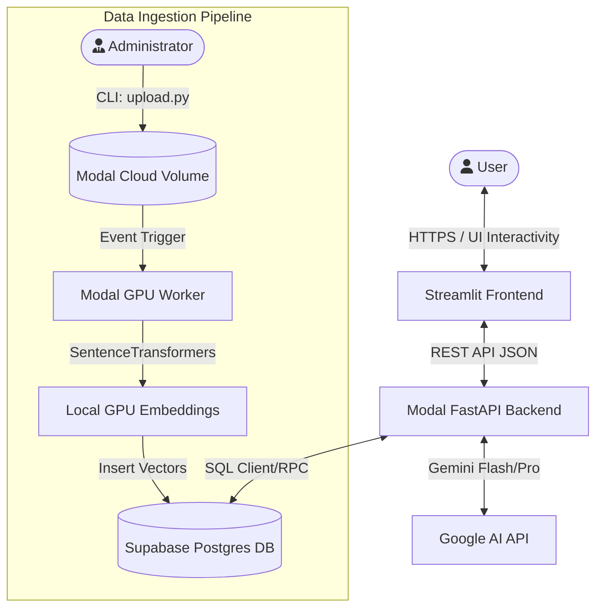
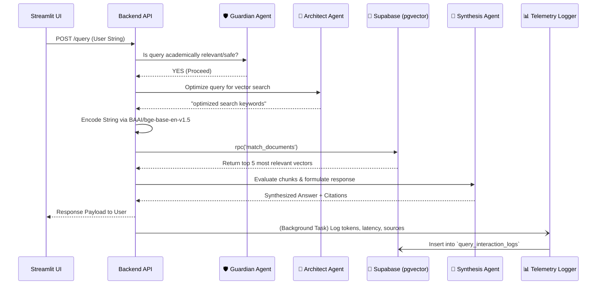
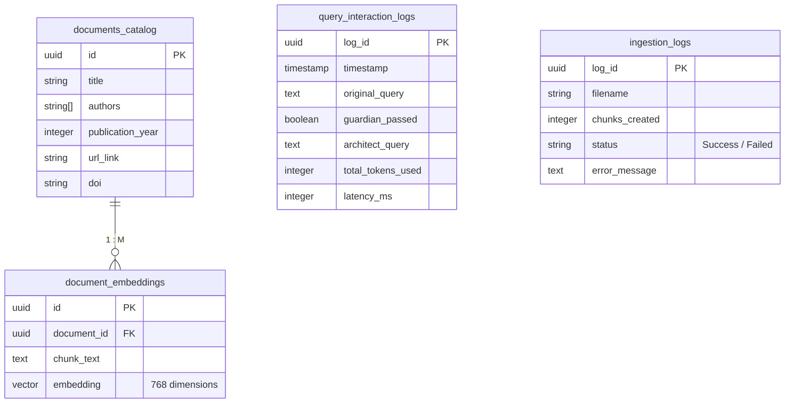

# acAIcia System Architecture

This dedicated document outlines the high-level infrastructure, multi-agent logic flow, and data pipelines powering **acAIcia**, the CIFOR-ICRAF Research Assistant.

## 1. High-Level Operations Overview

acAIcia relies on a fully serverless, highly decoupled ecosystem split between Streamlit Community Cloud (Frontend), Modal Serverless GPU Containers (Backend APIs & Data Ingestion), and Supabase (Postgres & Vector Store).



---

## 2. Multi-Agent Backend Engine (The Pipeline)

The core brain of acAIcia is a FastAPI app hosted on **Modal**. It utilizes a sophisticated 4-step processing pipeline where highly-specialized Google Gemini agents iteratively validate, optimize, and synthesize context pulled from your database.

By chaining explicit agents, the application remains incredibly rigorous regarding source attribution.



### Components of the Backend Strategy
*   **Guardian Agent** (Gemini 2.5 Flash): The fast interceptor. If a user asks about political opinions or recipes, the Guardian immediately bounces the request, preventing waste of expensive context tokens.
*   **Architect Agent** (Gemini 2.5 Flash): Conversational inputs naturally make terrible search queries. The architect strips stop-words and reformulates intents to maximize semantic density.
*   **Local Query Encoding** (`sentence-transformers`): Replaces external API limits by instantly encoding the optimized query into 768 dimensions locally within the container via HuggingFace models.
*   **Supabase Retrieval**: Performs exact Cosine Similarity calculations physically on the Postgres layer via the `match_documents` RPC.
*   **Synthesis Agent** (Gemini 2.5 Pro): Processes retrieved data blocks critically, ignoring poor matches and compiling academic prose complete with inline `[DocumentTitle, Year]` citations.
*   **Non-Blocking Telemetry**: Telemetry (Latency, Node execution times, Status checks) relies on FastAPI's `BackgroundTasks`, so the UI receives the response natively while analytical data syncs securely downstream.

---

## 3. The GPU Data Ingestion Cloud Engine

To keep embedding costs at practically zero and process massive libraries exceptionally quickly without rate limits, the ingestion framework operates directly on **Modal Volumes and T4/A10G Cloud GPUs**.

```mermaid
flowchart LR
    Docs[PDF, DOCX, MD, PPTX] -->|CLI upload.py| Vol{Modal Cloud Volume \n `/acaicia-data-volume`}
    Metadata[metadata.json] -->|Mapped Variables| Vol
    
    Vol -->|Run| App1[Modal Serverless App]
    
    subgraph Container Operations
    direction TB
    App1 --> Parser[PyMuPDF / docx Parser]
    Parser --> Chunking[LangChain RecursiveSplitter\n(2500 char shards)]
    Chunking --> Model[BAAI/bge-base-en-v1.5 \n HuggingFace GPU Model]
    Model --> Vectors[768 Dimension Arrays]
    end
    
    Vectors -->|Upload| DB_Vectors[Supabase `document_embeddings`]
    Metadata -->|Upload| DB_Meta[Supabase `documents_catalog`]
    Vectors -->|Log| TLog[Supabase `ingestion_logs`]
```

### Flow breakdown:
1.  **Local State**: The user simply runs `upload.py` on their local machine.
2.  **Persistent Volume**: All files and `metadata.json` configuration are silently transferred directly into a secured cloud Modal workspace mounted at `/data`.
3.  **VRAM Exploitation**: An image provisioned entirely with `PyTorch` and `SentenceTransformers` immediately loops through the volume parsing documents, generating 768-D vectors securely atop container GPUs.
4.  **Graceful Recovery**: State is recorded securely inside `/data/ingestion_state.json` inside the volume, enabling the system to skip prior successfully completed files on repeated runs natively!

---

## 4. The Database Scheme (PostgreSQL + pgvector)

acAIcia splits relational operations cleanly from semantic mathematical operations, relying on a deeply integrated Supabase layout that centralizes system health reporting alongside actual documents.


