# acAIcia Product Backlog & Engineering Roadmap

This document serves as the authoritative, git-tracked product backlog and execution roadmap for **acAIcia** (Landscape Alliance AI Research Assistant). It consolidates feature requests, architectural improvements, security hardening, and operational hotfixes derived from production telemetry, ADRs (ADR 0001–0010), and cloud deployment reviews.

---

## 🧭 Executive Summary & Priority Taxonomy

Work items are classified into four priority tiers based on production impact, security posture, and architectural dependency:

| Priority | Label | Urgency | Description |
|:---|:---|:---|:---|
| **P0** | `priority:p0` | **Immediate / Sprint 0** | **Production Hotfixes & Security Baseline**: Fixes active runtime bugs, security policy violations (ADR 0010), or unhandled exceptions impacting current production. |
| **P1** | `priority:p1` | **Current Phase (Phase 1)** | **High-ROI Wins & Strategic Alignment**: Direct UX improvements (streaming SSE), cost model calibration, and core retrieval accuracy upgrades. |
| **P2** | `priority:p2` | **Scale Phase (Phase 2)** | **Horizontal Scaling & Architecture**: Multi-replica shared state, native pgvector caching, automated CI evaluation gates, and observability. |
| **P3** | `priority:p3` | **Hardening Phase (Phase 3)** | **Long-Term Hardening & Cleanup**: Next-gen embeddings, structured outputs, and legacy codebase deprecation. |

---

## 🎯 Implementation Preference & Ordered Execution Plan

The recommended implementation sequence resolves dependencies, eliminates immediate operational friction first, and builds a stable foundation before scaling:

```mermaid
flowchart TD
    subgraph P0["Sprint 0: P0 Hotfixes & Security (Immediate)"]
        P0_1["#13: Migration 005 RLS & Invoker Fix"]
        P0_2["#14: Admin CSV Export 401 Fix"]
        P0_3["#15: Exact Token Telemetry (No 50/50 Split)"]
        P0_4["#16: Eval Worker Failure State Handling"]
        P0_5["#17: Legacy Modal POST /settings Auth"]
        P0_6["#18: Update Stale Modal URLs in Dev Tools"]
    end

    subgraph P1["Phase 1: High-ROI UX & Cost Strategy"]
        P1_1["#1: Streaming Responses (SSE)"]
        P1_2["#20: Cost Model Refinements (Cache/Overages/Seat)"]
        P1_3["#3: Cross-Encoder Reranker"]
        P1_4["#2: Unified LLM Gateway (LiteLLM)"]
    end

    subgraph P2["Phase 2: Horizontal Scaling & Quality Gates"]
        P2_1["#19: Shared Query Status Store (Multi-Replica)"]
        P2_2["#6: Native pgvector Semantic Cache"]
        P2_3["#8: Automated CI Evaluation Suite"]
        P2_4["#7: LLM Observability (Langfuse)"]
        P2_5["#4 & #5: HyDE & CRAG Relevance Gating"]
        P2_6["#12: LangGraph Orchestration"]
    end

    subgraph P3["Phase 3: Hardening & Evolution"]
        P3_1["#9: Embeddings & Chunking Upgrade (bge-m3)"]
        P3_2["#11: Structured Outputs (JSON Schema)"]
        P3_3["#10: Modal Legacy Code Deprecation"]
    end

    P0 --> P1 --> P2 --> P3
```



### Preferred Step-by-Step Execution Sequence

1. **Step 1 (Immediate Hotfix Batch — P0)**: Ship Issues **#13, #14, #15, #16, #17, #18** in a single focused PR.
   - *Why*: Eliminates active 401 errors, stops admin UI freezes on failed evals, restores exact token accounting for billing, secures rollback routes, and satisfies ADR 0010 database security before running Migration 005.
2. **Step 2 (UX & Cost Calibration — P1)**: Implement Issue **#1** (Streaming SSE) and update Issue **#20** (`docs/cost_model.md`).
   - *Why*: Streaming transforms perceived latency from 15–45s down to <2s. Calibrated cost modeling provides clear financial visibility before marketing acAIcia to more researchers.
3. **Step 3 (Retrieval Accuracy & Gateway Fallback — P1)**: Implement Issue **#3** (Reranker) followed by Issue **#2** (LiteLLM Gateway).
   - *Why*: Reranking improves `hit@1` by +5pp; LiteLLM guarantees zero-downtime failover across LLM providers.
4. **Step 4 (Multi-Replica State Preparation — P2)**: Implement Issue **#19** (Shared Query Status Store) before increasing Railway replicas beyond 1.
   - *Why*: Ephemeral local file status (`/tmp/acaicia_status`) fails as soon as a 2nd Railway container is spun up.
5. **Step 5 (Architecture & Automated Quality Gates — P2)**: Implement Issue **#6** (pgvector cache), Issue **#8** (CI evaluation gate), and Issue **#7** (Langfuse tracing).
6. **Step 6 (Advanced RAG & Graph Refactoring — P2)**: Implement Issues **#4, #5** (HyDE / CRAG) and **#12** (LangGraph).
7. **Step 7 (Hardening & Cleanup — P3)**: Implement Issues **#9, #11, #10** (bge-m3 re-embedding, JSON schema enforcement, and archiving legacy Modal code).

---

## 📋 Comprehensive Backlog Item Catalog

### Tier 0: P0 — Hotfixes & Production Security (Sprint 0)

---

#### Issue #13: Fix Migration 005 (RLS & Security Invoker) + Apply to Supabase
- **Priority**: `priority:p0` | **Phase**: Sprint 0 | **Effort**: Small (0.5 day)
- **Component**: Database (`database/migrations/005_evaluation_system.sql`, Supabase)
- **Problem Statement**:
  - `database/migrations/005_evaluation_system.sql` was never applied to production Supabase.
  - If applied as written, `canary_questions` and `evaluation_details` lack Row Level Security (`ENABLE ROW LEVEL SECURITY`), directly violating [ADR 0010](docs/adrs/0010-database-security-posture-rls-deny-by-default.md) (deny-by-default on all public tables).
  - The view `evaluation_score_trends` is missing `WITH (security_invoker = true)`, which bypasses caller permission boundaries and creates security linter warnings in Supabase.
  - Because Migration 005 was never applied, any evaluation run triggered via the Admin UI fails to persist per-question details or canary records in the database.
- **Implementation Strategy**:
  1. Modify `database/migrations/005_evaluation_system.sql`:
     - Add `ALTER TABLE evaluation_details ENABLE ROW LEVEL SECURITY;`.
     - Add `ALTER TABLE canary_questions ENABLE ROW LEVEL SECURITY;`.
     - Add `CREATE OR REPLACE VIEW evaluation_score_trends WITH (security_invoker = true) AS ...`.
  2. Execute migration in production Supabase SQL Editor.
  3. Verify table permissions and view definition via Supabase dashboard / linter.
- **Acceptance Criteria**:
  - `evaluation_details` and `canary_questions` have RLS enabled with zero public policies.
  - `evaluation_score_trends` is created with `security_invoker = true`.
  - Service role backend can insert and query rows cleanly.

---

#### Issue #14: Fix Admin CSV Export 401 Unauthorized via Query Parameter Auth
- **Priority**: `priority:p0` | **Phase**: Sprint 0 | **Effort**: Small (0.5 day)
- **Component**: Backend & Frontend (`backend/server.py`, `frontend/src/api/client.ts`, `frontend/src/pages/AdminPage.tsx`)
- **Problem Statement**:
  - Clicking "Export Query Logs (CSV)" in `/admin` fails with HTTP 401 Unauthorized in production.
  - The frontend download trigger uses `window.open(getExportCsvUrl(...))` or an `<a>` tag, which places the auth token in query parameters (`?authorization=Bearer ...`) because browser file downloads cannot attach custom HTTP headers without complex client-side blob streaming.
  - In `backend/server.py:1054`, `export_query_logs_csv` only checks `authorization: Optional[str] = Header(default=None)`. The header is `None`, causing `_require_admin` to reject the request with 401.
- **Implementation Strategy**:
  1. Update `backend/server.py` `export_query_logs_csv` signature:
     ```python
     @app.get("/admin/export/csv")
     def export_query_logs_csv(
         start_date: Optional[str] = None,
         end_date: Optional[str] = None,
         authorization: Optional[str] = Header(default=None),
         auth_token: Optional[str] = Query(default=None, alias="authorization"),
     ):
         token = authorization or auth_token
         _require_admin(token)
     ```
  2. Update `backend/app.py` legacy route to match.
  3. Verify CSV streaming works via direct URL download in browser and curl with Bearer header.
- **Acceptance Criteria**:
  - Admin users can successfully download `logs.csv` from `/admin` without 401 errors.
  - Both `Authorization: Bearer <KEY>` header and `?authorization=Bearer <KEY>` query parameter are supported and validated.
  - Requests with invalid or missing keys return HTTP 401.

---

#### Issue #15: Exact Token Telemetry & Eliminate Heuristic 50/50 Token Split
- **Priority**: `priority:p0` | **Phase**: Sprint 0 | **Effort**: Small (1 day)
- **Component**: Backend Telemetry (`backend/core.py`, `backend/pipeline.py`, `database/`)
- **Problem Statement**:
  - `backend/core.py` discards `prompt_tokens` and `completion_tokens` from LLM responses, returning only `{"text": ..., "tokens": total_tokens}`.
  - In `backend/pipeline.py:498-502`, because the breakdown is missing, synthesis tokens are split 50/50:
    `estimated_input = max(0, total_tokens - synth_res.get("tokens", 0) // 2)`
    `estimated_output = synth_res.get("tokens", 0) // 2`
  - In Mistral Small, input tokens cost $0.15/M while output tokens cost $0.60/M (4× higher). For typical RAG synthesis (2,500 input prompt tokens, 500 output tokens), the 50/50 split estimates 1,500 output tokens (+300% inflation), skewing cost telemetry in `query_interaction_logs` and invalidating live cost probes in `docs/cost_model.md`.
- **Implementation Strategy**:
  1. Modify `call_llm` in `backend/core.py` across all providers (Mistral, OpenAI, Gemini, Modal):
     - Extract `prompt_tokens = res.usage.prompt_tokens`, `completion_tokens = res.usage.completion_tokens`, and `total_tokens = res.usage.total_tokens`.
     - Return `{"text": text, "tokens": total_tokens, "prompt_tokens": prompt_tokens, "completion_tokens": completion_tokens}`.
  2. Update `backend/pipeline.py`:
     - Accumulate exact prompt tokens and completion tokens across Guardian, Architect, and Synthesis calls.
     - Eliminate the `// 2` heuristic.
     - Compute `estimated_cost_usd` using exact input/output counts.
  3. Apply corresponding update to `backend/app.py` for parity.
- **Acceptance Criteria**:
  - `query_interaction_logs` stores exact input and output token counts.
  - Cost calculations reflect true Mistral pricing without artificial inflation.
  - Verification test logs confirm `prompt_tokens + completion_tokens == total_tokens`.

---

#### Issue #16: Fix Evaluation Background Worker Uncaught Exception Handling
- **Priority**: `priority:p0` | **Phase**: Sprint 0 | **Effort**: Small (0.5 day)
- **Component**: Evaluation System (`backend/server.py`, `frontend/src/components/admin/EvaluationsTab.tsx`)
- **Problem Statement**:
  - In `backend/server.py:858`, `_run_evaluation_job` executes evaluation in a background thread.
  - If an uncaught exception occurs (e.g., Supabase network failure, Mistral rate limit 429, missing migration table), the thread catches `err`, logs it, and terminates.
  - The record in `evaluation_runs` remains stuck at `status: 'running'`.
  - In `frontend/src/components/admin/EvaluationsTab.tsx`, the polling loop checks `status === 'completed' || status === 'failed'`, causing the Admin UI to hang indefinitely with a spinning loader.
- **Implementation Strategy**:
  1. In `backend/server.py:877`, update the `except Exception as err:` block:
     ```python
     except Exception as err:
         logger.error("Evaluation background thread failed for run %s: %s", run_id, err, exc_info=True)
         try:
             supabase.table("evaluation_runs").update({
                 "status": "failed",
                 "details": {"error": str(err), "failed_at": datetime.now(tz.utc).isoformat()}
             }).eq("run_id", run_id).execute()
         except Exception as db_err:
             logger.error("Failed to update evaluation_runs status to failed: %s", db_err)
     ```
  2. Ensure frontend displays error details if run status is `'failed'`.
- **Acceptance Criteria**:
  - Any unhandled exception marks `evaluation_runs.status = 'failed'`.
  - Admin UI polling stops immediately and displays a clear error toast/banner.

---

#### Issue #17: Secure Legacy Modal Rollback `POST /settings` with Admin Auth
- **Priority**: `priority:p0` | **Phase**: Sprint 0 | **Effort**: Small (0.2 day)
- **Component**: Legacy Rollback Backend (`backend/app.py`)
- **Problem Statement**:
  - In `backend/app.py:1342`, `update_settings(request: SettingsRequest)` has NO authentication check.
  - In contrast, Railway backend (`backend/server.py:673`) enforces `_require_admin(authorization)`.
  - If a rollback to Modal is executed (per `docs/railway_migration.md`), the settings endpoint becomes unauthenticated, allowing any internet user to switch models or modify configuration, violating ADR 0002.
- **Implementation Strategy**:
  1. In `backend/app.py`, update `update_settings`:
     ```python
     @fastapi_app.post("/settings", response_model=SettingsResponse)
     def update_settings(request: SettingsRequest, authorization: Optional[str] = Header(default=None)):
         _require_admin(authorization)
         ...
     ```
  2. Ensure `_require_admin` helper exists and validates `ADMIN_API_KEY`.
- **Acceptance Criteria**:
  - `POST /settings` on `backend/app.py` requires valid Bearer `ADMIN_API_KEY`.
  - Unauthenticated requests return HTTP 401.

---

#### Issue #18: Update Stale Modal Backend URLs in Dev & Test Tooling
- **Priority**: `priority:p0` | **Phase**: Sprint 0 | **Effort**: Small (0.2 day)
- **Component**: Test Suite & CLI (`tests/deepeval_suite.py`, `cli_admin.py`)
- **Problem Statement**:
  - `tests/deepeval_suite.py:52` and `cli_admin.py:193` default to `https://ciforicraf-ai--acaicia-backend-fastapi-app-entrypoint.modal.run`.
  - Because Modal disabled the workspace after hitting spend caps, executing `pytest tests/` or running CLI admin scripts fails with connection/timeout errors unless the developer manually overrides environment variables.
- **Implementation Strategy**:
  1. In `tests/deepeval_suite.py:52`, change `DEFAULT_BACKEND_URL`:
     `DEFAULT_BACKEND_URL = os.environ.get("BACKEND_URL", "https://acaicia-backend-production.up.railway.app")`
  2. In `cli_admin.py:193`, update fallback:
     `return os.environ.get("ACAICIA_BACKEND_URL", "https://acaicia-backend-production.up.railway.app")`
- **Acceptance Criteria**:
  - Running `python cli_admin.py metrics` connects to Railway backend out of the box.
  - Running test suite targets active Railway infrastructure by default.

---

### Tier 1: P1 — High-ROI Wins & Strategic Alignment (Phase 1)

---

#### Issue #1: Streaming Responses + Replace File Polling (SSE)
- **Priority**: `priority:p1` | **Phase**: Phase 1 | **Effort**: Medium (5–8 days)
- **Component**: Backend & Frontend (`backend/server.py`, `backend/pipeline.py`, `frontend/src/context/ChatContext.tsx`, `frontend/src/api/client.ts`)
- **Problem Statement**:
  - Currently, `POST /query` enqueues a background task and returns `{ query_id, status: "processing" }`.
  - Frontend polls `GET /query/status/{query_id}` every 1–2 seconds for up to 180 seconds, reading a JSON file from disk.
  - Perceived latency is 15–45s before the user sees a single character of output.
  - Polling creates high request churn and latency jitter.
- **Implementation Strategy**:
  1. Add Server-Sent Events (SSE) endpoint: `POST /query/stream` using FastAPI `StreamingResponse(media_type="text/event-stream")`.
  2. Stream events: `{ type: "stage", stage: "guardian"|"architect"|"retrieving"|"synthesizing" }`, `{ type: "sources", sources: [...] }`, `{ type: "token", text: "..." }`, `{ type: "done", telemetry: {...} }`.
  3. Update `frontend/src/context/ChatContext.tsx` to consume the stream via `fetch` + `ReadableStreamDefaultReader` or `@microsoft/fetch-event-source`.
  4. Retain legacy polling endpoint as a fallback for flaky mobile connections.
- **Acceptance Criteria**:
  - Time-to-first-token (TTFT) perceived latency < 2.0s.
  - Dynamic token-by-token rendering in chat UI.
  - Zero polling HTTP requests during streaming sessions.

---

#### Issue #20: Cost Model Refinements & Clarifications (`docs/cost_model.md`)
- **Priority**: `priority:p1` | **Phase**: Phase 1 | **Effort**: Small (1 day)
- **Component**: Strategic Documentation (`docs/cost_model.md`)
- **Problem Statement**:
  - In `docs/cost_model.md §4`, Railway compute is modeled as flat $20 across all phases (10 → 500 users). When scaling to 2+ backend replicas (Phase 2–4), memory and CPU overages will exceed the included $20 credit ($10/GB-mo, $20/vCPU-mo), requiring documented budget allowances.
  - The model assumes a fixed cache behavior without detailing the progressive increase from initial launch (~10% cache hit rate) to steady-state corpus maturity (~30% cache hit rate), which lowers the effective per-query cost.
  - The $24.99/mo Mistral Team seat fee requires re-evaluation: analyze whether pay-as-you-go developer API tier saves $300/year or if Team seat features (RBAC, shared workspaces) justify the cost.
- **Implementation Strategy**:
  1. Update `docs/cost_model.md §4`:
     - Add explicit replica scaling table showing Railway compute overages ($20 base + $15/replica/mo).
     - Incorporate cache hit progression curve (10% at launch → 20% at 100 users → 30% at 500 users) and show net savings.
     - Add comparative analysis: Mistral Pay-As-You-Go vs Team Seat ($24.99/mo).
  2. Refresh Mermaid charts to reflect the adjusted curves.
- **Acceptance Criteria**:
  - Cost table includes multi-replica compute overheads for Phases 2, 3, and 4.
  - Cache savings trajectory is clearly documented.
  - Recommendation on Mistral seat tier is formally captured.

---

#### Issue #3: Cross-Encoder Reranker for Hybrid Retrieval
- **Priority**: `priority:p1` | **Phase**: Phase 1 | **Effort**: Small (2–3 days)
- **Component**: Retrieval Engine (`backend/pipeline.py`, `backend/core.py`)
- **Problem Statement**:
  - Hybrid RRF merges dense vector cosine similarity and full-text TSVECTOR keyword ranks.
  - However, RRF rank fusion does not perform semantic cross-attention between user query and retrieved chunk texts, occasionally allowing weakly relevant keyword matches into the top 5 synthesis context.
- **Implementation Strategy**:
  1. Retrieve top 20 candidate chunks via Supabase `match_documents_hybrid`.
  2. Re-score candidates using a fast cross-encoder (e.g., `cross-encoder/ms-marco-MiniLM-L-6-v2` or Cohere/Mistral reranker API).
  3. Select top 5 chunks for Synthesis Agent.
- **Acceptance Criteria**:
  - Benchmark retrieval accuracy on `test_questions_difficult.csv` shows `hit@1` improvement ≥ +5pp.
  - Re-ranking latency overhead < 300ms on CPU.

---

#### Issue #2: Unified LLM Gateway via LiteLLM with Provider Fallback
- **Priority**: `priority:p1` | **Phase**: Phase 1 | **Effort**: Medium (3–5 days)
- **Component**: LLM Inference (`backend/core.py`, `backend/config.py`)
- **Problem Statement**:
  - Current LLM calling logic uses bespoke SDK code for Mistral, Gemini, NVIDIA, and DeepSeek.
  - If Mistral API experiences rate limiting (429) or an outage (503), the entire pipeline fails rather than gracefully failing over to Gemini 2.5 Flash or NVIDIA Llama 3.3.
- **Implementation Strategy**:
  1. Integrate `litellm` in `backend/core.py`.
  2. Configure automatic fallback cascades: `mistral/mistral-small-latest` → `gemini/gemini-2.5-flash` → `deepseek/deepseek-chat`.
  3. Unify token usage and cost accounting through LiteLLM's standardized response object.
- **Acceptance Criteria**:
  - Simulated Mistral 500/429 errors trigger seamless automatic fallback to secondary provider without user-facing failure.
  - Standardized latency and token metrics across all providers.

---

### Tier 2: P2 — Scaling Infrastructure & Architecture (Phase 2)

---

#### Issue #19: Shared Query Status Store (Supabase/Redis) for Multi-Replica Scaling
- **Priority**: `priority:p2` | **Phase**: Phase 2 | **Effort**: Medium (3–4 days)
- **Component**: Backend State Management (`backend/server.py`, Supabase / Redis)
- **Problem Statement**:
  - `backend/server.py` tracks in-flight query states via ephemeral JSON files in `/tmp/acaicia_status/{query_id}.json`.
  - When traffic scales to Phase 2 (100 users, 10,000 queries/mo) and Railway scales to 2+ backend containers, requests are load-balanced across replicas.
  - A client polling `GET /query/status/{query_id}` may hit Replica B while Replica A is processing the query, resulting in false 404s or missed progress indicators.
- **Implementation Strategy**:
  1. Option A (Supabase-native): Use a `query_jobs` table with realtime updates or row-level state tracking.
  2. Option B (Redis): Provision Railway Redis service and replace `STATUS_DIR` file I/O with Redis key-value store with TTL (1 hour).
  3. Update `set_query_status` and `get_query_status` in `backend/server.py` to use the shared store.
- **Acceptance Criteria**:
  - Multi-replica load-balancing tests verify that query status can be read from any replica regardless of which replica executes the pipeline.
  - In-flight stage transitions are visible across containers.

---

#### Issue #6: Semantic Cache → Native pgvector HNSW Query
- **Priority**: `priority:p2` | **Phase**: Phase 2 | **Effort**: Small (2–3 days)
- **Component**: Database & Cache (`backend/core.py`, `database/migrations/`)
- **Problem Statement**:
  - Current semantic cache loads up to 200 rows into Python memory and executes a brute-force cosine similarity loop (`backend/core.py:180-230`).
  - As cache size grows past 1,000 entries, this introduces memory bloat and latency bottlenecks.
- **Implementation Strategy**:
  1. Store cache embeddings as native `vector(768)` in `semantic_cache`.
  2. Create an HNSW index on `semantic_cache(embedding vector_cosine_ops)`.
  3. Query cache via a single Supabase RPC call (`match_semantic_cache`) with topic filtering.
- **Acceptance Criteria**:
  - Cache lookup latency < 15ms regardless of cache size (scales to 100,000+ entries).
  - Python brute-force cosine loop eliminated.

---

#### Issue #8: Automated CI Evaluation Suite & Quality Gates
- **Priority**: `priority:p2` | **Phase**: Phase 2 | **Effort**: Medium (4–6 days)
- **Component**: CI/CD & Testing (`.github/workflows/`, `tests/deepeval_suite.py`, `backend/evaluation_engine.py`)
- **Problem Statement**:
  - Evaluations are currently triggered manually via `/admin`.
  - Regressions in prompt modifications, chunking, or retrieval logic are not caught before code merges to `main`.
- **Implementation Strategy**:
  1. Add GitHub Actions workflow running `tests/deepeval_suite.py` against a smoke subset (10 questions) on PRs.
  2. Assert baseline thresholds: Faithfulness ≥ 0.85, Context Recall ≥ 0.75, Canary Violation Rate = 0.
  3. Block merge if metrics regress by > 0.05 against `tests/eval_baseline.json`.
- **Acceptance Criteria**:
  - Automated PR check executes evaluation and posts metric diff comment.
  - Regressions block deployment.

---

#### Issue #7: LLM Observability & Tracing (Langfuse / OpenTelemetry)
- **Priority**: `priority:p2` | **Phase**: Phase 2 | **Effort**: Medium (3–5 days)
- **Component**: Observability (`backend/server.py`, `backend/pipeline.py`)
- **Problem Statement**:
  - Debugging multi-agent pipeline bottlenecks requires querying Supabase logs or parsing Railway container stdout.
  - No visual waterfall traces showing Guardian vs Architect vs Retrieval vs Synthesis latencies per query.
- **Implementation Strategy**:
  1. Integrate Langfuse SDK or OpenTelemetry spans into `backend/pipeline.py`.
  2. Trace each agent execution with input prompt, output tokens, latency, and estimated cost.
- **Acceptance Criteria**:
  - Every production query produces a linked trace in Langfuse dashboard.
  - Zero performance impact on query execution.

---

#### Issue #4: HyDE & Multi-Query Expansion
- **Priority**: `priority:p2` | **Phase**: Phase 2 | **Effort**: Small (2–4 days)
- **Component**: Retrieval Agent (`backend/pipeline.py`)
- **Problem Statement**:
  - User queries are often brief or phrased colloquially, missing formal academic terminology present in CIFOR-ICRAF manuscripts.
- **Implementation Strategy**:
  1. Implement Hypothetical Document Embeddings (HyDE): Query Architect generates a hypothetical abstract, which is embedded alongside the query.
  2. Generate 3 multi-query variations and execute reciprocal rank fusion across all candidate sets.
- **Acceptance Criteria**:
  - Retrieval `hit@1` increases by ≥ 3pp on complex queries.

---

#### Issue #5: Corrective RAG (CRAG) Relevance Gate
- **Priority**: `priority:p2` | **Phase**: Phase 2 | **Effort**: Medium (4–6 days)
- **Component**: Retrieval & Synthesis (`backend/pipeline.py`)
- **Problem Statement**:
  - If retrieval returns low-relevance chunks, Synthesis Agent may attempt to extrapolate or abstain clumsily.
- **Implementation Strategy**:
  1. Score retrieved chunk relevance using a lightweight evaluator.
  2. If confidence is below threshold (< 0.6), trigger secondary search expansion or explicitly instruct synthesis to abstain with polite domain guidance.
- **Acceptance Criteria**:
  - Faithfulness score increases by ≥ 0.05.
  - Hallucination rate on out-of-domain queries drops to 0.

---

#### Issue #12: LangGraph Multi-Agent Pipeline Re-Architecture
- **Priority**: `priority:p2` | **Phase**: Phase 2 | **Effort**: Extra-Large (8–12 days)
- **Component**: Core Pipeline (`backend/pipeline.py`)
- **Problem Statement**:
  - Pipeline logic is currently procedural Python with manual thread pools and ad-hoc error handling.
- **Implementation Strategy**:
  1. Refactor pipeline into a directed state graph using LangGraph.
  2. Model Guardian, Architect, Retrieval, CRAG, and Synthesis as nodes with conditional edges and automatic node retries.
- **Acceptance Criteria**:
  - Clean state graph with checkpoint resumption and visual graph debugging.

---

### Tier 3: P3 — Long-Term Hardening & Cleanup (Phase 3)

---

#### Issue #9: Embeddings & Chunking Upgrade (`BAAI/bge-m3` + Parent-Child)
- **Priority**: `priority:p3` | **Phase**: Phase 3 | **Effort**: Large (6–10 days)
- **Component**: Ingestion & Search (`ingestion/`, `backend/core.py`, Supabase)
- **Problem Statement**:
  - Current embeddings use `bge-base-en-v1.5` (768d, English only) with fixed chunk sizes.
  - Research corpus contains multilingual references (French, Spanish, Indonesian) and nested document structures.
- **Implementation Strategy**:
  1. Upgrade to `BAAI/bge-m3` (1024d, 8192 context window, multilingual support).
  2. Implement parent-child hierarchical chunking (small chunks for vector matching, parent chunks for synthesis context).
  3. Run re-embedding pipeline on Supabase corpus.
- **Acceptance Criteria**:
  - Native multilingual query matching in Spanish, French, and Indonesian.
  - Context precision increases by ≥ 0.08.

---

#### Issue #11: Structured Outputs & JSON Schema Validation
- **Priority**: `priority:p3` | **Phase**: Phase 3 | **Effort**: Small (2–3 days)
- **Component**: Agents (`backend/pipeline.py`)
- **Problem Statement**:
  - Guardian and Architect rely on free-text generation parsed via substring matching (`"PASS"` in response) or regex.
- **Implementation Strategy**:
  1. Enforce JSON schema validation via Mistral structured outputs / Pydantic models.
  2. Add automatic schema retry loops on invalid JSON.
- **Acceptance Criteria**:
  - Zero malformed agent response errors in production logs.

---

#### Issue #10: Deprecate & Archive Legacy Modal Codebase
- **Priority**: `priority:p3` | **Phase**: Phase 3 | **Effort**: Small (2–3 days)
- **Component**: Repository Hygiene (`backend/app.py`, `backend/gemma_inference.py`)
- **Problem Statement**:
  - `backend/app.py` is a 2,000-line monolithic file retained strictly for Modal emergency rollback.
  - Maintaining dual backends creates maintenance overhead and confusion.
- **Implementation Strategy**:
  1. Once Railway backend demonstrates 99.9% uptime over 90 days, archive `backend/app.py` to `archive/legacy_modal/`.
  2. Remove Modal-specific secrets and scripts.
- **Acceptance Criteria**:
  - Root `backend/` contains only active Railway modules (`server.py`, `pipeline.py`, `core.py`, `config.py`, `evaluation_engine.py`).

---

## 📊 Traceability Matrix & Cross-References

| Backlog Issue | Primary Component | Related ADR / Document | Target Metric / Outcome |
|:---|:---|:---|:---|
| **#13** | Database Migration | [ADR 0010](docs/adrs/0010-database-security-posture-rls-deny-by-default.md) | 100% RLS compliance; eval persistence |
| **#14** | Admin CSV Export | [ADR 0002](docs/adrs/0002-machine-uuid-guest-tracking-and-admin-model-governance.md) | Zero 401 errors on admin CSV downloads |
| **#15** | Token Telemetry | [docs/cost_model.md](docs/cost_model.md) | Exact input/output token cost tracking |
| **#16** | Evaluation Worker | [docs/evaluation_guide.md](docs/evaluation_guide.md) | Zero hanging UI loops on eval failure |
| **#17** | Modal Rollback Security | [ADR 0009](docs/adrs/0009-migrate-backend-from-modal-to-railway.md) | Auth parity on rollback endpoints |
| **#18** | Dev Tooling Endpoints | [docs/deployment_guide.md](docs/deployment_guide.md) | Out-of-the-box working CLI and tests |
| **#1** | Streaming (SSE) | [ADR 0008](docs/adrs/0008-query-polling-resilience-and-database-status-fallback.md) | Time-to-first-token < 2.0s |
| **#20** | Cost Model Refinements | [docs/cost_model.md](docs/cost_model.md) | Accurate multi-replica & cache budget |
| **#3** | Cross-Encoder Reranker | [ADR 0005](docs/adrs/0005-hybrid-sparse-dense-retrieval-via-reciprocal-rank-fusion.md) | hit@1 +5pp |
| **#2** | Unified LLM Gateway | [ADR 0009](docs/adrs/0009-migrate-backend-from-modal-to-railway.md) | Zero downtime on provider rate limits |
| **#19** | Shared Status Store | [ADR 0009](docs/adrs/0009-migrate-backend-from-modal-to-railway.md) | Stateless backend; multi-replica ready |
| **#6** | Native pgvector Cache | [ADR 0007](docs/adrs/0007-domain-bounded-semantic-cache-with-topic-isolation.md) | Cache lookup < 15ms at 100k rows |
| **#8** | CI Evaluation Gate | [docs/evaluation_guide.md](docs/evaluation_guide.md) | Automated regression blocking in CI |
| **#7** | LLM Observability | [AGENTS.md](AGENTS.md) | Full multi-agent traces in Langfuse |
| **#4 & #5** | HyDE & CRAG | [docs/backend_agents.md](docs/backend_agents.md) | Faithfulness +0.05, hit@1 +3pp |
| **#12** | LangGraph Pipeline | [docs/architecture.md](docs/architecture.md) | Visual state machine & resilient retries |
| **#9** | Embeddings Upgrade | [docs/data_ingestion.md](docs/data_ingestion.md) | Multilingual search & context precision +0.08 |
| **#11** | Structured Outputs | [docs/backend_agents.md](docs/backend_agents.md) | Zero schema validation failures |
| **#10** | Modal Legacy Archive | [docs/railway_migration.md](docs/railway_migration.md) | Simplified codebase hygiene |
