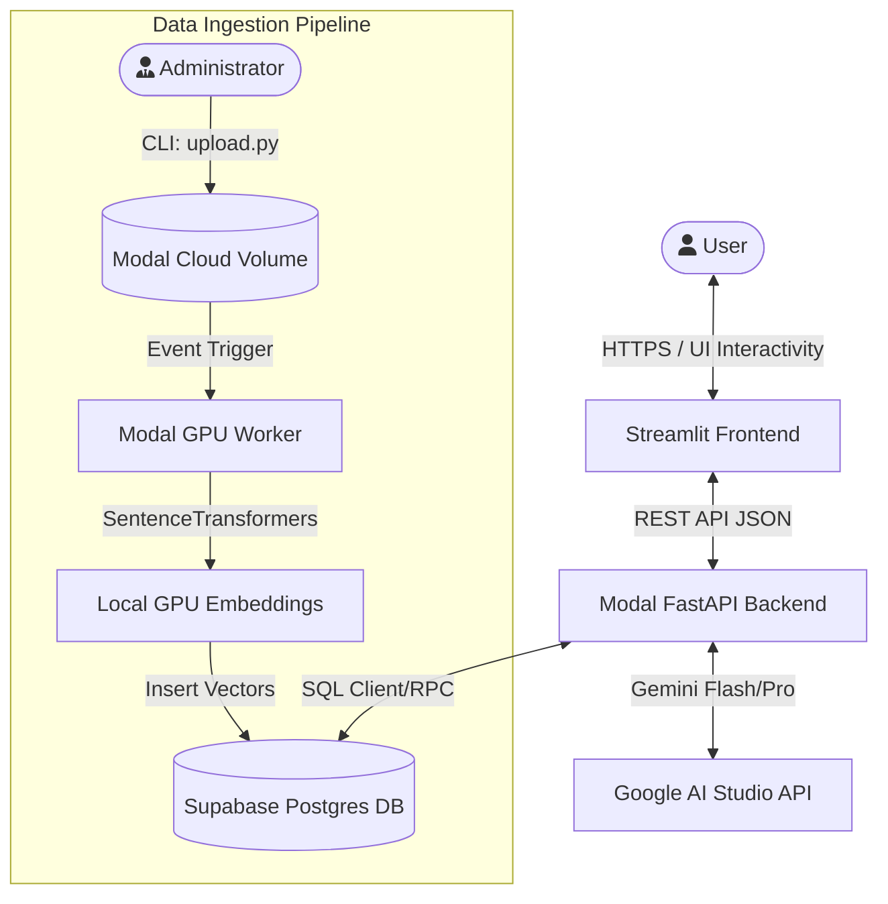

# acAIcia System Architecture

[← Back to README](../README.md)

This dedicated document outlines the high-level infrastructure, multi-agent logic flow, and data pipelines powering **acAIcia**, the CIFOR-ICRAF Research Assistant.

## 1. High-Level Operations Overview

acAIcia relies on a fully serverless, highly decoupled ecosystem split between Streamlit Community Cloud (Frontend), Modal Serverless GPU Containers (Backend APIs & Data Ingestion), and Supabase (Postgres & Vector Store).

## Detailed Modules
For more specific inner workings, consult the specialized documentation:
- [Backend Agents Engine](backend_agents.md)
- [Data Ingestion Pipeline](data_ingestion.md)
- [Frontend Architecture](frontend.md)
- [Database Schema](database_schema.md)
