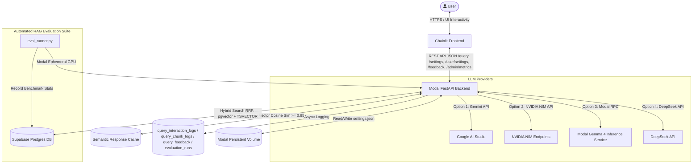

# acAIcia System Architecture

[← Back to README](../README.md)

This document outlines the high-level infrastructure, multi-agent logic flow, and data pipelines powering **acAIcia**, the Landscape Alliance AI Research Assistant.

## 1. High-Level Operations Overview

acAIcia relies on a fully serverless, highly decoupled ecosystem split between Chainlit (Frontend), Modal Serverless Containers (FastAPI Backend, Persistent Settings Volume, and Self-Hosted Gemma 4 Inference Service), and Supabase (Postgres, pgvector, & Full-Text Search).

```mermaid
flowchart TD
    User([fa:fa-user User]) <-->|HTTPS / UI Interactivity| UI[Chainlit Frontend]
    UI <-->|REST API JSON /query, /settings, /user/settings, /feedback, /admin/metrics| API[Modal FastAPI Backend]
    
    %% Semantic Cache check
    API <-->|Vector Cosine Sim >= 0.95| Cache[(Semantic Response Cache)]
    
    %% Hybrid Retrieval
    API <-->|Hybrid Search RRF: pgvector + TSVECTOR| DB[(Supabase Postgres DB)]
    
    %% Telemetry & Feedback
    API -->|Async Logging| Tel[(query_interaction_logs / query_chunk_logs / query_feedback / evaluation_runs)]
    
    %% Config & Volume
    API <-->|Read/Write settings.json| Vol[(Modal Persistent Volume)]
    
    %% Provider Routing
    subgraph LLM Providers
        API -->|Option 1: Gemini API| Gemini[Google AI Studio]
        API -->|Option 2: NVIDIA NIM API| NIM[NVIDIA NIM Endpoints]
        API <-->|Option 3: Modal RPC| Gemma[Modal Gemma 4 Inference Service]
        API -->|Option 4: DeepSeek API| DeepSeek[DeepSeek API]
    end
    
    %% Evaluation Suite
    subgraph Automated RAG Evaluation Suite
        EvalRunner[eval_runner.py] -->|Modal Ephemeral GPU| API
        EvalRunner -->|Record Benchmark Stats| DB
    end
```

## 2. Core Architectural Pillars

1. **Dual Session & Profile Management:**
   - **Guest Session Mode:** Immediate access without login using local browser session IDs.
   - **Authenticated Mode:** Persistent multi-device conversation history, user profiles, and **Custom Research Instructions** passed directly into Synthesis prompts.
2. **Semantic Response Caching:**
   - Vector similarity search (`semantic_cache`) returning instant answers (<50ms) for repeat or near-identical queries (similarity >= 0.95), reducing VRAM/API load.
3. **Hybrid Search (Dense pgvector + Sparse Full-Text RRF):**
   - Reciprocal Rank Fusion (`match_documents_hybrid` RPC) combining dense vector embeddings with PostgreSQL `to_tsvector` text search for high precision on exact species names, DOIs, years, and acronyms.
4. **Granular Telemetry & Chunk Ranking:**
   - Per-stage execution timers (`guardian_ms`, `architect_ms`, `retrieval_ms`, `synthesis_ms`) logged to `query_interaction_logs`.
   - Detailed chunk ranking metadata (`vector_score`, `text_score`, `rrf_score`, `final_rank`) logged to `query_chunk_logs`.
5. **In-Chat Feedback & Quality Loop:**
   - Interactive feedback buttons (`👍 Useful`, `👎 Needs Work`) and correction inputs attached to response messages, logged to `query_feedback`.
6. **Admin Observability & RAG Evaluation Dashboard:**
   - Live dashboard view (`/admin`) displaying p50/p95 latency metrics, cache hit rate %, token costs, user satisfaction sentiment, and automated RAG evaluation benchmark history (`evaluation_runs`).

---

## Detailed Modules
For more specific inner workings, consult the specialized documentation:
- [Backend Agents Engine](backend_agents.md)
- [Data Ingestion Pipeline](data_ingestion.md)
- [Frontend Architecture](frontend.md)
- [Database Schema](database_schema.md)
- [Deployment & Setup Guide](deployment_guide.md)
