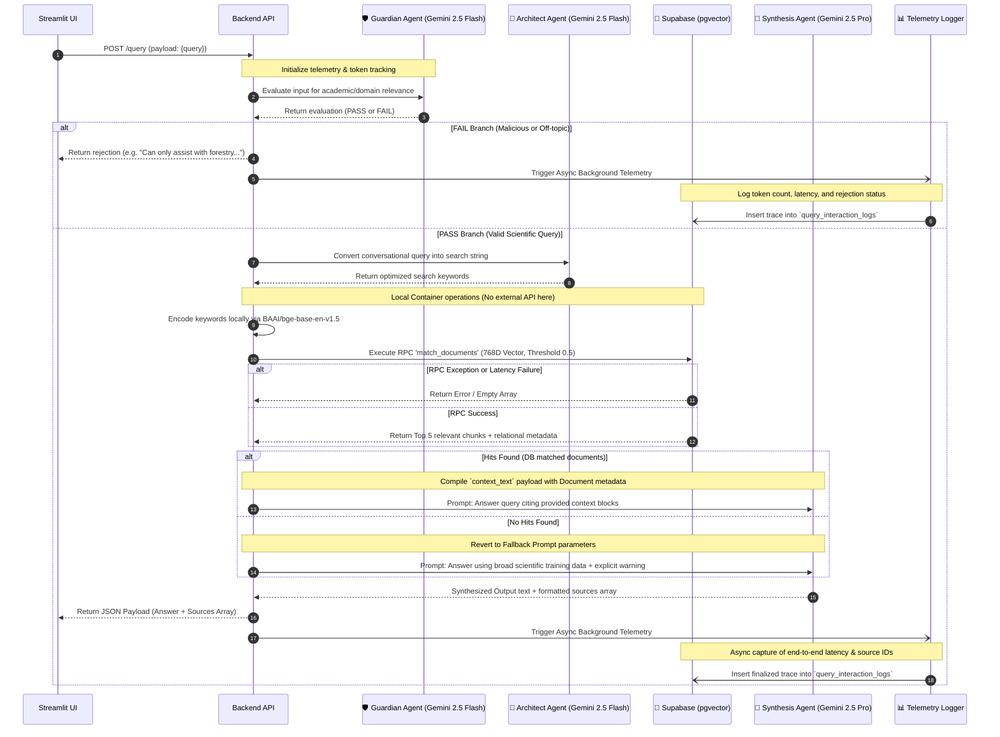

# Multi-Agent Backend Engine (The Pipeline)

[← Back to README](../README.md)

The core brain of acAIcia is a FastAPI app (`backend/app.py`) hosted on **Modal**. It utilizes a sophisticated 4-step processing pipeline where highly-specialized Google Gemini agents iteratively validate, optimize, and synthesize context pulled from your database. By chaining explicit agents, the application remains incredibly rigorous regarding source attribution.

## Comprehensive Sequence Diagram

The following diagram illustrates every API hop, asynchronous background task, and conditional guardrail branch that handles a single user request.

## Exploring the Agents & Fallbacks

1. **Guardian Agent (Gemini 2.5 Flash)**
   The fastest and cheapest interceptor. If a user asks about political opinions or general recipes, the Guardian immediately branches into the **FAIL path**, protecting the entire system from wasting expensive context tokens downstream. It guarantees interactions remain strictly within the CIFOR-ICRAF mandate.

2. **Architect Agent (Gemini 2.5 Flash)**
   Conversational inputs naturally make terrible search queries. Passing the safeguard, the architect strips stop-words and reformulates intents to maximize semantic density. This ensures the string sent to the local `sentence-transformers` library produces a vector highly aligned for cosine-similarity matching against the chunks in the database.

3. **Supabase pgvector Retrieval RPC**
   The backend translates the Architect's keywords locally using `BAAI/bge-base-en-v1.5` and fires the 768-D array to Supabase. Supabase performs the mathematical matching algorithm under the hood, natively resolving structural metadata (Titles, Authors) alongside the semantic chunks.

4. **Synthesis Agent (Gemini 2.5 Pro)**
   The powerhouse node. The Synthesis Agent receives two distinct prompts based on the results from Supabase:
   * **The Citation Prompt:** If vectors match, it instructs the agent to answer with rigorous inline citations `[Author, Year]`, ignoring any chunk information that contradicts the query.
   * **The Fallback Prompt:** If no internal knowledge is retrieved, the agent uses its baseline scientific training to attempt an answer, but its system prompt mandates it warn the user that the knowledge is unsupported by the internal CIFOR-ICRAF knowledge base.

## Non-Blocking Asynchronous Telemetry

To measure API performance, track latency bottlenecks, and account for API token usage securely, the FastAPI backend passes a telemetry dictionary through every node step. 

Crucially, rather than making the user wait for logging to finish, the Backend returns its payload to the Streamlit UI immediately, while utilizing FastAPI's `BackgroundTasks` to invisibly flush the telemetry array into Supabase's `query_interaction_logs` database table.
