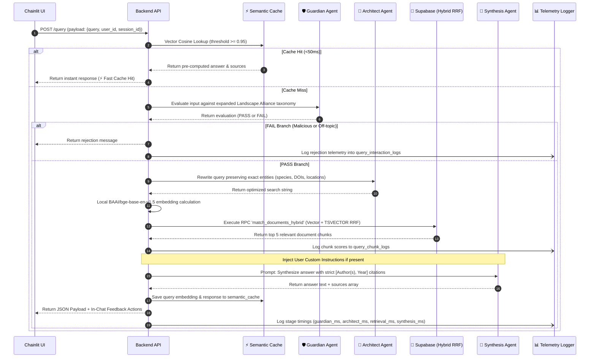

# Multi-Agent Backend Engine (The Pipeline)

[← Back to README](../README.md)

The core brain of acAIcia is a FastAPI app (`backend/app.py`) hosted on **Modal**. It utilizes a sophisticated multi-agent pipeline where specialized agents validate, optimize, retrieve, and synthesize research contexts pulled from internal publication knowledge bases.

## Comprehensive Sequence Diagram

```mermaid
sequenceDiagram
    autonumber
    
    participant UI as Chainlit UI
    participant BP as Backend API
    participant Cache as ⚡ Semantic Cache
    participant GA as 🛡️ Guardian Agent
    participant AA as 🧠 Architect Agent
    participant DB as 🐘 Supabase (Hybrid RRF)
    participant SA as 📝 Synthesis Agent
    participant Tel as 📊 Telemetry Logger
    
    UI->>BP: POST /query (payload: {query, user_id, session_id})
    
    %% Step 0: Semantic Cache Check
    BP->>Cache: Vector Cosine Lookup (threshold >= 0.95)
    alt Cache Hit (<50ms)
        Cache-->>BP: Return pre-computed answer & sources
        BP-->>UI: Return instant response (⚡ Fast Cache Hit)
    else Cache Miss
        %% Step 1: Guardian Check
        BP->>GA: Evaluate input against expanded Landscape Alliance taxonomy
        GA-->>BP: Return evaluation (PASS or FAIL)
        
        alt FAIL Branch (Malicious or Off-topic)
            BP-->>UI: Return rejection message
            BP-)Tel: Log rejection telemetry into query_interaction_logs
        else PASS Branch
            %% Step 2: Architect Optimization
            BP->>AA: Rewrite query preserving exact entities (species, DOIs, locations)
            AA-->>BP: Return optimized search string
            
            %% Step 3: Hybrid Retrieval (Dense Vector + Full-Text RRF)
            BP->>BP: Local BAAI/bge-base-en-v1.5 embedding calculation
            BP->>DB: Execute RPC 'match_documents_hybrid' (Vector + TSVECTOR RRF)
            DB-->>BP: Return top 5 relevant document chunks
            BP-)Tel: Log chunk scores to query_chunk_logs
            
            %% Step 4: Synthesis Agent
            Note over BP, SA: Inject User Custom Instructions if present
            BP->>SA: Prompt: Synthesize answer with strict [Author(s), Year] citations
            SA-->>BP: Return answer text + sources array
            
            %% Save to Cache & Telemetry
            BP->>Cache: Save query embedding & response to semantic_cache
            BP-->>UI: Return JSON Payload + In-Chat Feedback Actions
            BP-)Tel: Log stage timings (guardian_ms, architect_ms, retrieval_ms, synthesis_ms)
        end
    end
```

---

## Agent Prompt Specifications & Design Rationale

### 1. Guardian Agent (Scope Guardrail)
- **Domain Taxonomy:** Expanded based on Landscape Alliance (CIFOR-ICRAF) Knowledge Library scope:
  - *Forestry & Agroforestry:* Silvopasture, tree cover, ecosystem restoration, wood fuel.
  - *Climate Change:* Mitigation, adaptation, blue carbon (mangroves), GHG emissions.
  - *Soil & Peatlands:* Peatland hydrology, groundwater depths, soil organic carbon, erosion.
  - *Food Systems:* Low-emission food systems, crop productivity, land rights.
  - *Fire Management & Health:* Prescribed burning (GlobalRx), smoke haze, public health impacts.
  - *Biodiversity:* Wildlife ecology, mammal responses to fire/drought.
  - *Regional Policy:* ASEAN strategies, CGIAR initiatives, policy briefs, regional case studies (Ghana, Sumatra, Kalimantan, Mediterranean, Guyana, The Gambia).
- **Permissive Stance:** Adopts a permissive rule allowing all natural science, environmental management, geography, and policy queries while rejecting only explicit spam or malicious prompts.

### 2. Architect Agent (Query Reformulation)
- **Entity Preservation Rule:** Instructed to strictly preserve exact geographic entities (*Pulang Pisau*, *South Sumatra*, *Ghana*), DOIs, acronyms (*ASEAN*, *GHG*), dates/years, and quantitative terms (*78.5 cm*, *204,517*) to maximize Reciprocal Rank Fusion (RRF) search accuracy.

### 3. Synthesis Agent (Answer Generation & Personalization)
- **User Preference Injection:** Dynamically appends user custom research instructions from settings into the prompt context.
- **Citation Discipline:** Strictly mandates inline `[Author(s), Year]` scientific citations.

---

## Semantic Response Caching
Incoming queries are converted to vector embeddings and queried against `semantic_cache`. Queries matching existing entries with a cosine similarity >= 0.95 bypass the Guardian, Architect, and LLM Synthesis agents, returning stored answers in <50ms with `cache_hit: true` telemetry tags.

---

## Admin Observability & Metrics Endpoints
- `GET /admin/metrics`: Returns p50/p95 latency stats, stage-by-stage latency averages (`guardian_ms`, `architect_ms`, `retrieval_ms`, `synthesis_ms`), cache hit rate %, token costs, user feedback sentiment (+1 / -1 ratio), and recent evaluation benchmark runs.
- `POST /feedback`: Records inline upvote/downvote ratings and user corrections in `query_feedback`.
