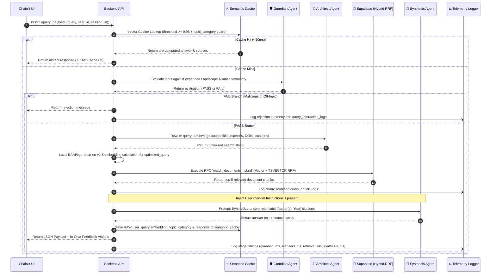

# Multi-Agent Backend Engine (The Pipeline)

[← Back to README](../README.md)

The core brain of acAIcia is a FastAPI app (`backend/app.py`) hosted on **Modal**. It utilizes a sophisticated multi-agent pipeline where specialized agents validate, optimize, retrieve, and synthesize research contexts pulled from internal publication knowledge bases.

## Comprehensive Sequence Diagram

```mermaid
sequenceDiagram
    autonumber
    
    participant UI as Chainlit UI
    participant BP as Backend API
    participant Cache as ⚡ Semantic Cache
    participant GA as 🛡️ Guardian Agent
    participant AA as 🧠 Architect Agent
    participant DB as 🐘 Supabase (Hybrid RRF)
    participant SA as 📝 Synthesis Agent
    participant Tel as 📊 Telemetry Logger
    
    UI->>BP: POST /query (payload: {query, user_id, session_id})
    
    %% Step 0: Semantic Cache Check
    BP->>Cache: Vector Cosine Lookup (threshold >= 0.98 + topic_category guard)
    alt Cache Hit (<50ms)
        Cache-->>BP: Return pre-computed answer & sources
        BP-->>UI: Return instant response (⚡ Fast Cache Hit)
    else Cache Miss
        %% Step 1: Guardian Check
        BP->>GA: Evaluate input against expanded Landscape Alliance taxonomy
        GA-->>BP: Return evaluation (PASS or FAIL)
        
        alt FAIL Branch (Malicious or Off-topic)
            BP-->>UI: Return rejection message
            BP-)Tel: Log rejection telemetry into query_interaction_logs
        else PASS Branch
            %% Step 2: Architect Optimization
            BP->>AA: Rewrite query preserving exact entities (species, DOIs, locations)
            AA-->>BP: Return optimized search string
            
            %% Step 3: Hybrid Retrieval (Dense Vector + Full-Text RRF)
            BP->>BP: Local BAAI/bge-base-en-v1.5 embedding calculation for optimized_query
            BP->>DB: Execute RPC 'match_documents_hybrid' (Vector + TSVECTOR RRF)
            DB-->>BP: Return top 5 relevant document chunks
            BP-)Tel: Log chunk scores to query_chunk_logs
            
            %% Step 4: Synthesis Agent
            Note over BP, SA: Inject User Custom Instructions if present
            BP->>SA: Prompt: Synthesize answer with strict [Author(s), Year] citations
            SA-->>BP: Return answer text + sources array
            
            %% Save to Cache & Telemetry
            BP->>Cache: Save RAW user_query embedding, topic_category & response to semantic_cache
            BP-->>UI: Return JSON Payload + In-Chat Feedback Actions
            BP-)Tel: Log stage timings (guardian_ms, architect_ms, retrieval_ms, synthesis_ms)
        end
    end
```

---

## Agent Prompt Specifications & Design Rationale

### 1. Guardian Agent (Scope Guardrail)
- **Domain Taxonomy:** Expanded based on Landscape Alliance (CIFOR-ICRAF) Knowledge Library scope:
  - *Forestry & Agroforestry:* Silvopasture, tree cover, ecosystem restoration, wood fuel.
  - *Climate Change:* Mitigation, adaptation, blue carbon (mangroves), GHG emissions.
  - *Soil & Peatlands:* Peatland hydrology, groundwater depths, soil organic carbon, erosion.
  - *Food Systems:* Low-emission food systems, crop productivity, land rights.
  - *Fire Management & Health:* Prescribed burning (GlobalRx), smoke haze, public health impacts.
  - *Biodiversity:* Wildlife ecology, mammal responses to fire/drought.
  - *Regional Policy:* ASEAN strategies, CGIAR initiatives, policy briefs, regional case studies (Ghana, Sumatra, Kalimantan, Mediterranean, Guyana, The Gambia).
- **Permissive Stance:** Adopts a permissive rule allowing all natural science, environmental management, geography, and policy queries while rejecting only explicit spam or malicious prompts.

### 2. Architect Agent (Query Reformulation)
- **Entity Preservation Rule:** Instructed to strictly preserve exact geographic entities (*Pulang Pisau*, *South Sumatra*, *Ghana*), DOIs, acronyms (*ASEAN*, *REDD+*), dates/years, and quantitative terms (*78.5 cm*, *204,517*) to maximize Reciprocal Rank Fusion (RRF) search accuracy.

### 3. Synthesis Agent (Answer Generation & Personalization)
- **User Preference Injection:** Dynamically appends user custom research instructions from settings into the prompt context.
- **Citation Discipline:** Strictly mandates inline `[Author(s), Year]` scientific citations.

---

## Semantic Response Caching Subsystem

Incoming single-turn queries undergo vector similarity matching against `semantic_cache`:
1. **Raw Vector Alignment**: Embeddings are computed directly from `user_query` (never from Query Architect's `optimized_query`).
2. **Domain Topic Isolation Guard**: Cache lookup enforces matching `topic_category` (e.g., `fire_management` queries only match cached items tagged with `fire_management`).
3. **Threshold Calibration**: Matches require cosine similarity $\ge 0.98$.
4. **Session Guard**: Checked **only for standalone single-turn queries** (`if not conversation_history`). Multi-turn conversation sessions bypass semantic cache to maintain conversation session context.

---

## Admin Observability & Analytics Platform

acAIcia includes a comprehensive admin analytics backend supporting parametric filtering, cost attribution, query topic intelligence, time-of-day heatmaps, production RAGAS scoring, and exportable CSV reports:

- `GET /admin/metrics`: Accepts parametric filters (`start_date`, `end_date`, `topic`, `provider`, `query_type`, `hour_start`, `hour_end`). Returns KPI metrics, token splits (input vs output), estimated USD costs, latency percentiles (P50, P95, P99), time-series breakdown, 7×24 hourly activity heatmap, user satisfaction %, and system alerts.
- `GET /admin/users`: Paginated per-user cost & query breakdown (registered user email or anonymous guest session UUID).
- `GET /admin/topics`: Returns domain taxonomy query counts and distribution across 9 core categories + general fallback.
- `GET /admin/documents/popular`: Ranks most frequently retrieved internal documents with average Reciprocal Rank Fusion (RRF) scores.
- `GET /admin/cache/stats` & `POST /admin/cache/clear`: Semantic cache statistics and truncation control.
- `GET /admin/alerts` & `POST /admin/alerts/{alert_id}/resolve`: System health alerts (e.g. retrieval gap warnings when general fallback >15%).
- `GET /admin/evaluations`: Paginated batch evaluation history + production RAGAS evaluation scores (Faithfulness, Answer Relevance, Context Precision).
- `GET /admin/export/csv`: Streams full interaction logs in CSV format for funder reporting.
- `POST /feedback`: Records inline upvote/downvote ratings and user corrections in `query_feedback`.

### Topic Classification Subsystem
Query topic classification uses a **hybrid keyword-first pass** matching 9 research domains (`peatlands`, `fire_management`, `food_systems`, `agroforestry`, `climate_change`, `soil_science`, `biodiversity`, `policy`, `methodology`). Unmatched queries fall back to **Modal Gemma** for LLM classification without incurring extra API costs.

### Production RAGAS Scoring
Approximately **5% of live production traffic** is probabilistically sampled and evaluated asynchronously by Modal Gemma for RAGAS metrics:
- **Faithfulness** (0.0-1.0): Answer support by retrieved context.
- **Answer Relevance** (0.0-1.0): Relevance of answer to query.
- **Context Precision** (0.0-1.0): Relevance of retrieved document chunks.

### Security & Authentication
All `/admin/*` endpoints require an `Authorization: Bearer <ADMIN_API_KEY>` header when `ADMIN_API_KEY` is configured in Modal secrets.

