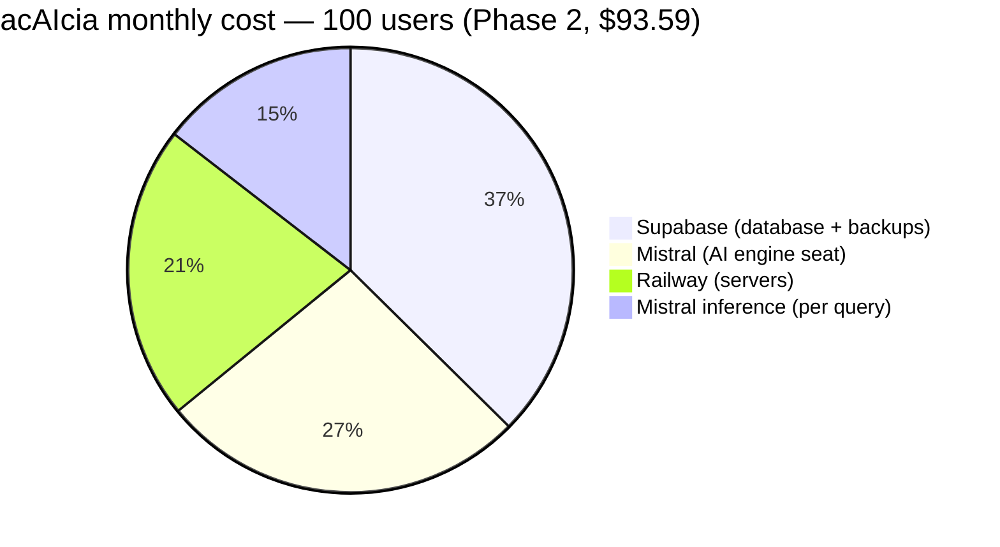
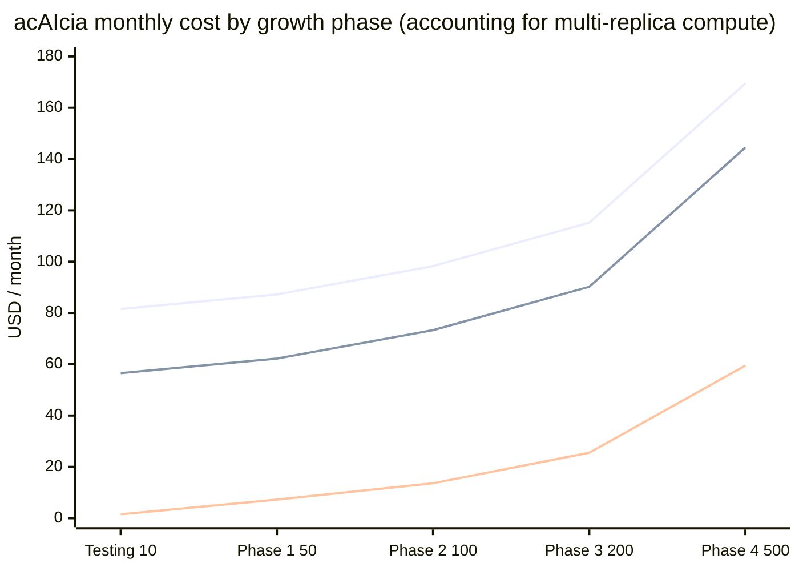
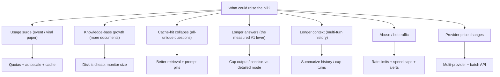
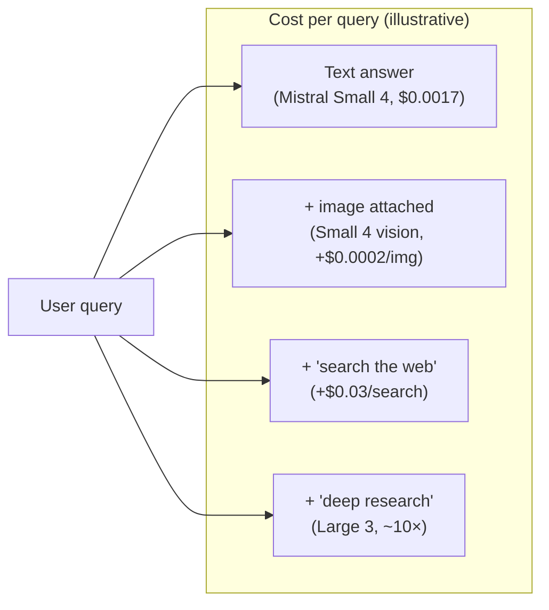

# acAIcia — Cost Estimates & Scaling Plan

- **Date**: 2026-09-28 (revised with live measurements)
- **Status**: Living document — refresh quarterly as usage and prices change
- **Planning assumption**: **100 queries per user per month**
- **Data sources**: measured (Supabase telemetry, Railway usage/metrics, live query probes) + published pricing (Mistral, Supabase, Railway) verified 2026-09

---

## 0. Executive summary (for leadership)

acAIcia costs roughly the price of a couple of software subscriptions, and its
cost is **predictable** because ~80% of it is flat monthly platform fees rather
than usage.

* **At launch (10 users)**: ≈ **$82/month**, all-in.
* **At 500 users**: ≈ **$145/month** — **$63 more than at 10 users**, and most of
  that is AI inference.
* One answered question costs about **$0.0017 in AI** (measured live) — a
  question answered from cache costs ~$0.

We run on paid, production-grade infrastructure from day one (guaranteed database
uptime, daily backups, redundant servers) rather than free tiers, so the service
never pauses, keeps restorable backups, and survives a server failure.



---

## 1. How these numbers were produced

Grounded in, not guessed from:

1. **Measured usage** — query counts, token counts, latency, and cache-hit rate
   from our database telemetry.
2. **Live query probes** — we asked the running system easy/medium/hard questions
   and read back the exact tokens and cost for each (§2.2).
3. **Measured infrastructure usage** — memory/CPU/egress from Railway's billing API.
4. **Published pricing** — Mistral, Supabase, and Railway (verified September 2026).

Raw numbers and re-measure commands are in §9 (Data appendix).

---

## 2. Measured baseline

### 2.1 Traffic & telemetry

| Metric | Lifetime | Last 24 h |
|---|---|---|
| Queries logged | 360 | 5 |
| Distinct users | 15 | 5 |
| Cache hits | 12 (3.3%) | 3 (60%)* |
| Avg total tokens / query | 4,536 | 2,293** |

\* small sample. Plan with 10–30% cache-hit rate.
\** skewed low by cache hits in the window (see §2.2 for clean numbers).

### 2.2 Live cost probes (easy / medium / hard)

We asked the running Railway backend three questions of increasing complexity and
read the exact per-query telemetry from the database:

| Probe | Total tokens | Input | Output | **Cost** | Latency |
|---|---|---|---|---|---|
| Easy (one-sentence) | 3,936 | 2,313 | 1,623 | **$0.00132** | 5.3 s |
| Medium (synthesis) | 6,200 | 3,459 | 2,741 | **$0.00216** | 10.2 s |
| Hard (comparative) | 5,130 | 2,961 | 2,169 | **$0.00175** | 9.8 s |

**The finding that changes our estimates:** cost is driven by **how long the
answer is** (output tokens) and the **retrieval context size**, *not* by how
"difficult" the question looks. The medium question produced the longest answer
(5,086 characters) and cost the most. The one-sentence answer was cheapest and
fastest (5.3 s).

> **Planning figure: ≈ $0.0017 per uncached query** (median), range
> $0.0013–$0.0022. This is **~2× our earlier estimate**, which had been diluted by
> cache hits. This is now the number used throughout §4.

### 2.3 Infrastructure footprint

| Object | Value |
|---|---|
| Database size | 218 MB (embeddings 203 MB) |
| Documents / chunks | 452 / 21,119 |
| Backend RAM (Railway) | ~1 GB warm → ≈ $10/mo |
| Frontend RAM | ~70 MB → ≈ $0.70/mo |

---

## 3. Published pricing (verified 2026-09)

### Mistral

**Team seat (1 user):** `$24.99/mo` (workspace/collaboration; no included API credits).

**Inference (per 1M tokens):**

| Model (role) | Input | Output |
|---|---|---|
| Mistral Small 4 `mistral-small-latest` (synthesis/architect) | $0.15 | $0.60 |
| Ministral 3B `ministral-3b-latest` (guardian) | $0.10 | $0.10 |
| Ministral 8B `ministral-8b-latest` (judge/fallback) | $0.15 | $0.15 |

**Tool / specialist APIs (for the upgrades in §6):**

| API | Price |
|---|---|
| Web search | $30 / 1,000 calls ($0.03/search) |
| Premium news | $50 / 1,000 calls |
| Libraries (document upload) | OCR $3/1k pages · indexing $1/M tokens · $0.01/call |
| OCR 4.1 | $4 / 1,000 pages |
| Mistral Embed | $0.10 / 1M input tokens |
| Mistral Large 3 | $0.50 in / $1.50 out |
| Mistral Medium 3.5 | $1.50 in / $7.50 out |
| Moderation 2 | free |

> Batch API = −50%; cached input tokens = −90%.

### Supabase

Pro $25/mo (daily backups 7 d, no-pause, 250 GB egress) · compute Micro $10 / Small $15 / Medium $60 · PITR $100/mo · Read Replica = same compute rate as primary + 1.25× disk.

### Railway

Pro $20/mo + $20 credit (42 replicas, 30-day logs) · memory $10/GB-mo · CPU $20/vCPU-mo · egress $0.05/GB.

---

## 4. Cost by phase (100 queries/user/month, corrected)

### 4.1 Multi-Replica Compute & Cache Progression Details

Our financial model accounts for two dynamic scaling phenomena:
1. **Cache-hit progression**: As the research corpus and repeated queries mature, the semantic cache hit rate climbs from **10% at launch** to **20% at 100 users** and **30% at steady-state (500 users)**. At a median cost of $0.0017/query, this progressive compounding generates significant net savings on inference bills.
2. **Railway multi-replica compute overages**: Railway Pro ($20/mo) includes a $20/month compute credit.
   - **1 replica (Testing & Phase 1)**: ~1 GB RAM ($10/mo) + frontend ($0.70/mo) = $10.70 compute, completely absorbed by the $20 credit. Railway total = **$20.00/mo**.
   - **2 replicas (Phase 2 & Phase 3)**: 2 × 1 GB RAM ($20/mo) + frontend ($0.70/mo) + CPU usage ($4/mo) = $24.70 compute ($4.70 overage). Railway total = **$24.70/mo**.
   - **3 replicas (Phase 4)**: 3 × 1 GB RAM ($30/mo) + frontend ($1.00/mo) + CPU/egress ($14.00/mo) = $45.00 compute ($25.00 overage). Railway total = **$45.00/mo**.



| Phase | Users | Queries/mo | Cache Hit % | Net AI Queries | Mistral Inference | Mistral Seat* | Supabase | Railway (Replicas) | **Total (Team)** | **Total (PAYG)** |
|---|---|---|---|---|---|---|---|---|---|---|
| **Testing** | 10 | 1,000 | 10% | 900 | $1.53 | $24.99 | $35 | $20.00 (1 rep) | **$81.52** | **$56.53** |
| **Phase 1** | 50 | 5,000 | 15% | 4,250 | $7.23 | $24.99 | $35 | $20.00 (1 rep) | **$87.22** | **$62.23** |
| **Phase 2** | 100 | 10,000 | 20% | 8,000 | $13.60 | $24.99 | $35 | $24.70 (2 rep) | **$98.29** | **$73.30** |
| **Phase 3** | 200 | 20,000 | 25% | 15,000 | $25.50 | $24.99 | $40 | $24.70 (2 rep) | **$115.19** | **$90.20** |
| **Phase 4** | 500 | 50,000 | 30% | 35,000 | $59.50 | $24.99 | $40 | $45.00 (3 rep) | **$169.49** | **$144.50** |

\* *Mistral Team Seat vs Pay-As-You-Go Developer Tier (§4.2 below)*: Pay-As-You-Go eliminates the $24.99/mo fee, saving ~$300/year.

**Hardened option** (+ Supabase PITR $100/mo from Phase 2): P2 $198.29 · P3 $215.19 · P4 $269.49.

### 4.2 Comparative Evaluation: Mistral Team Seat vs Pay-As-You-Go Tier

| Feature / Attribute | Mistral Pay-As-You-Go ($0/mo) | Mistral Team Seat ($24.99/mo) | Strategic Recommendation |
|---|---|---|---|
| **API Inference Pricing** | Identical ($0.15/M in, $0.60/M out) | Identical ($0.15/M in, $0.60/M out) | Parity |
| **Model & Tool Availability** | All models (Small, Ministral, Embed) | All models (Small, Ministral, Embed) | Parity |
| **Workspace RBAC** | Single account / API key owner | Multi-user roles (Admin, Member) | Beneficial only for multi-dev teams |
| **Key Scoping & Audit** | Single global API key | Granular per-service keys + usage audit | Useful at enterprise scale (Phase 3+) |
| **Annual Cost Impact** | **$0/year** baseline | **$299.88/year** | **Recommendation: Start on Pay-As-You-Go during Testing & Phase 1; upgrade to Team Seat in Phase 2 or 3 when multiple institutional admins require role delegation.** |

---

## 5. Cost-increase factors (what actually moves the bill)



| Factor | Mechanism | Impact | Adaptation |
|---|---|---|---|
| **Longer answers** (measured) | Output tokens are the cost driver | 1.5–2× per query | Cap `max_tokens`; add "concise vs detailed" mode |
| **Longer context** | Multi-turn history grows each turn | linear token growth | summarize history; cap turns; cache |
| **Cache-hit decline** | unique questions → more full syntheses | up to ~2× inference | better retrieval (RRF on), prompt pills, streaming |
| **Knowledge-base growth** | more chunks → storage + index + context | DB size + egress | monitor `pg_database_size`; disk is $0.125/GB |
| **Usage surge** | event-driven 10× volume | inference + egress scale | quotas, cache pushdown (−4× egress), autoscale |
| **Premium model** | "deep research" on Large/Medium | 10–12× synthesis cost | optional premium mode with quota |
| **Abuse/bots** | scripted API calls | unbounded | rate limits + spend caps + alerts (already on) |
| **Provider price changes** | Mistral/Supabase/Railway raise rates | ~$8/mo per 10% | multi-provider pipeline; batch API |

The single biggest lever we measured is **answer length** — a simple, high-value
control: shorter answers are cheaper *and* faster (5 s vs 10 s).

---

## 6. Possible upgrades — researched & costed (Mistral)

These are optional capability upgrades, each with a concrete cost and a path to
handle it. All prices are Mistral's published API rates (verified 2026-09).

| Upgrade | What it adds | Cost basis | Added $/mo (illustrative) | How to handle |
|---|---|---|---|---|
| **Multimodal / image understanding** | Read maps, charts, field photos, figures | Mistral Small 4 is already multimodal — images billed as input tokens at $0.15/M (~1,000–1,500 tok/image ≈ $0.00015–0.00023/img) | negligible per image | No new model/subscription; extend the pipeline to pass image URL/base64; add Shieldstral image guard |
| **Web search** | Live, cited web results to complement the KB | Mistral Web Search $30/1k = $0.03/search | e.g. 20% of queries → +$0.006/query (~$60/mo at 10k q) | Optional toggle; cheaper (Tavily/Brave) if volume grows |
| **Publication-source connectors** | Pull metadata/abstracts from Crossref, OpenAlex, Semantic Scholar, PubMed, arXiv, DOAJ | APIs are free/rate-limited; real cost = ingestion (embedding ~9.6 KB/chunk + Supabase storage/egress) | one-time embedding + small storage growth | Ingest selectively through the existing pipeline; reuse OCR for scans |
| **Premium "deep research" model** | Higher-quality synthesis on demand | Mistral Large 3 $0.5/$1.5 or Medium 3.5 $1.5/$7.5 (≈10–12× Small) | 10% premium queries → +$0.01–0.02/query | Optional premium mode with per-user quota + batch for evals |
| **Hosted embeddings** | Offload local embedding RAM (no torch) | Mistral Embed $0.10/M input | ~$0.0002/query + re-embed corpus | Trade RAM for per-query cost; keep local bge default |
| **OCR / Document AI** | Parse scanned/legacy literature | OCR $4/1k pages; Doc AI $5/1k pages | one-time per ingested page | For ingestion of scanned literature |
| **Image+text moderation** | Guard multimodal inputs | Moderation 2 free; Shieldstral 1.0 open | $0 | Add Shieldstral to Guardian for image inputs |

### Upgrade decision view



### Which upgrades we'd pursue first (system-design reasoning)

1. **Multimodal (image) — highest value, lowest cost.** The model already
   supports it; it's a thin pipeline change, marginal cost is ~$0.0002/image, and
   it directly serves researchers (maps, field data, charts, figures).
2. **Publication-source connectors — highest research value.** Free APIs; the
   real cost is ingestion, which we already do. Broaden coverage with Crossref +
   OpenAlex + arXiv with negligible new spend.
3. **Web search — useful, but gate it.** $0.03/search is ~20× a text answer, so
   make it an explicit opt-in per query rather than default-on.
4. **Premium model — defer.** Add "deep research" only if researchers ask for it;
   keep a per-user quota so it can't dominate the bill.

---

## 7. Optimum architecture changes per phase

| Phase | Change | Why |
|---|---|---|
| Testing (10) | Railway Pro + Supabase Pro day one; ONNX embeddings (`fastembed`); seed pills; spend caps | uptime, backups, −$8/mo/replica, predictability |
| P1 (50) | Push cache similarity into Postgres (ADR 0006 follow-up); rate limiting | −4× egress; protect inference |
| P2 (100) | 2 replicas + queue; move status to Supabase; PITR; split eval worker | HA + DR + horizontal readiness |
| P3 (200) | Supabase Small; OTel tracing; stream answers; "concise vs detailed" toggle | headroom, observability, cost control |
| P4 (500) | CDN; 3+ replicas + autoscale; alarms; replica only if CPU > 70% | global latency, resilience |

---

## 8. Bottom line for decision-makers

- **~$82/month today, ~$145/month at 500 users** — growth adds ~$63.
- **~$80/month is fixed, protective infrastructure** (uptime, backups, redundancy).
- **One question costs ~$0.0017 in AI**; cache hits are free.
- **The one lever that matters is answer length** — shorter answers are cheaper
  and faster; we can offer a "concise" mode for a 2× cost cut.
- **Planned upgrades (images, web search, external sources) are cheap** and can
  be gated behind quotas, so they add capability without adding risk.

---

## 9. Data appendix (re-measure any time)

```bash
# Railway usage + metrics
railway usage projects --workspace "Bongwe Obaga's Projects" --project acaicia --period current --json
railway metrics --service "acAIcia Backend" --since 24h --step 87 --json

# Supabase telemetry (SQL editor / MCP)
select log_id, total_tokens_used, input_tokens, output_tokens, estimated_cost_usd, latency_ms
from query_interaction_logs order by timestamp desc limit 20;

select pg_size_pretty(pg_database_size(current_database()));

# Pricing (verified 2026-09)
#   https://mistral.ai/pricing   https://supabase.com/pricing   https://railway.com/pricing
#   Vision: https://docs.mistral.ai/capabilities/vision
```
