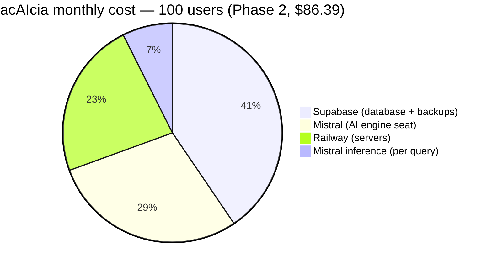
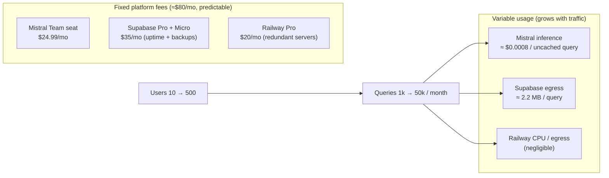
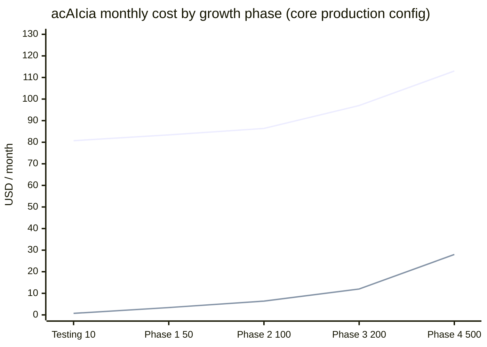
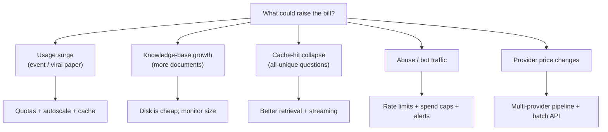

# acAIcia — Cost Estimates & Scaling Plan

- **Date**: 2026-09-28
- **Status**: Living document — refresh quarterly as usage and prices change
- **Planning assumption**: **100 queries per user per month**
- **Data sources**: measured (Supabase telemetry, Railway usage/metrics) + published pricing (Mistral, Supabase, Railway) verified 2026-09

---

## 0. Executive summary (for leadership)

acAIcia is **cheap to run** — roughly the price of a couple of office software
subscriptions — and its cost is **predictable**, because almost all of it is flat
monthly platform fees rather than usage.

* **At launch (10 users)**: ≈ **$81/month**, all-in.
* **At 500 users**: ≈ **$113/month** — only **$32 more** than at 10 users.
* The only cost that grows with use is the AI inference itself, and it is tiny:
  even at 500 users issuing 50,000 queries a month, inference is ≈ **$28/month**
  (about **$0.0008 per question**).

We deliberately run the system on **paid, production-grade infrastructure from
day one** — guaranteed database uptime, daily backups, and redundant servers —
rather than starting on free tiers and migrating later. That choice costs about
**$80/month** in fixed fees, but it means the service does not pause when idle,
keeps restorable backups, and survives a server failure with no data loss.



---

## 1. How these numbers were produced

We did not guess. The model is grounded in:

1. **Measured usage** from the live system — query counts, token counts, latency,
   and cache-hit rate pulled from our own database telemetry.
2. **Measured infrastructure usage** — actual memory/CPU/egress from Railway's
   billing and metrics APIs.
3. **Published, current pricing** — Mistral, Supabase, and Railway pricing pages
   (verified September 2026).

Full raw numbers and the commands to re-measure them are in §8 (Data appendix).

---

## 2. The money flow

Costs split into two kinds: **fixed platform fees** (paid every month regardless
of traffic) and **variable usage** (grows with the number of questions).



The key structural insight: **fixed fees ≈ $80/mo, variable usage ≈ pennies.**
Doubling users barely moves the total bill.

---

## 3. Detailed line-by-line breakdown

### 3.1 Mistral — the AI engine (≈ $25–53/mo)

Two separate charges:

| Charge | What it is | Monthly |
|---|---|---|
| **Team seat** (1 user) | Organisation workspace + collaboration features | **$24.99** (flat) |
| **Inference** | Pay-per-token for the three models below | varies with usage |

The inference models used (prices per 1,000,000 tokens):

| Model | Job | Input | Output |
|---|---|---|---|
| Mistral Small 4 (`mistral-small-latest`) | Write the answer + expand the query | $0.15 | $0.60 |
| Ministral 3B (`ministral-3b-latest`) | Safety guard | $0.10 | $0.10 |
| Ministral 8B (`ministral-8b-latest`) | Quality scoring / fallback | $0.15 | $0.15 |

Each answered question costs ≈ **$0.0008** in inference; a question answered from
cache costs ≈ **$0**.

> Note: the Team seat is a *productivity* subscription (workspace, collaboration).
> The API itself needs no subscription — if the organisation only needs raw API
> access, drop the seat and save $24.99/mo.

### 3.2 Supabase — the database (≈ $35/mo + optional DR)

| Charge | Price | Why we pay it |
|---|---|---|
| Pro plan | $25/mo | **Guaranteed uptime** (Free tier pauses after 1 week idle) + **daily backups (7 days)** + 250 GB egress + spend caps |
| Compute (Micro) | $10/mo | 1 GB RAM, 200 pooled connections — ample for current load |
| *(optional)* PITR | $100/mo | Point-in-time recovery to any moment (low-RPO disaster recovery) |
| *(optional)* Read Replica | $15/mo each | Only if the primary CPU sustains > 70% — unlikely at our scale |

The database currently holds 452 documents (21,119 chunks) in **218 MB** — well
inside the 8 GB Pro allowance, with room to grow ~35×.

### 3.3 Railway — the servers (≈ $20/mo)

| Charge | Price | Why |
|---|---|---|
| Pro plan | $20/mo | Includes $20 usage credit, 42 replicas, 30-day logs, RBAC, environment budgets |

Usage is billed per-second but stays within the $20 credit:
- Backend server: ~1 GB RAM → ~$10/mo (or ~$2/mo after the ONNX optimisation).
- Frontend static server: ~70 MB → ~$0.70/mo.
- CPU + egress: negligible.

---

## 4. Cost by phase (100 queries / user / month)



| Phase | Users | Queries/mo | Mistral seat | Mistral inference | Supabase | Railway | **Total** |
|---|---|---|---|---|---|---|---|
| Testing | 10 | 1,000 | $24.99 | $0.72 | $35 | $20 | **$80.71** |
| Phase 1 | 50 | 5,000 | $24.99 | $3.40 | $35 | $20 | **$83.39** |
| Phase 2 | 100 | 10,000 | $24.99 | $6.40 | $35 | $20 | **$86.39** |
| Phase 3 | 200 | 20,000 | $24.99 | $12.00 | $40 | $20 | **$96.99** |
| Phase 4 | 500 | 50,000 | $24.99 | $28.00 | $40 | $20 | **$112.99** |

**Hardened option** (add Supabase PITR at $100/mo from Phase 2): P2 $186 · P3 $197 · P4 $213.

Read the "flat" shape of the chart: the fixed fees carry the system; usage is a
thin, slow-growing sliver on top.

---

## 5. Cost spikes: what could move the bill, and how we respond

Nothing here is expected, but good budgeting plans for the unlikely. Each item
below states **what it is, how likely it is, the cost impact, how we adapt, and
what value it represents** to the mission.



### 5.1 Usage surge (research event, a paper goes viral, a conference)
- **What**: 10× the normal query volume for a week.
- **Impact**: Mistral inference scales linearly but stays trivial (10× ≈ $50–280/mo in the worst case). The real pressure is Supabase egress (~2.2 MB/query) and concurrent server load.
- **How we adapt**: per-user rate limits + quotas; push the cache similarity into the database (cuts egress 4×); Railway autoscales replicas automatically.
- **Value**: this is the system doing its job — high-impact research moments should be absorbed, not throttled away. Our cost model makes absorbing them cheap.

### 5.2 Knowledge-base growth (ingesting thousands of new documents)
- **What**: the corpus grows from 452 → thousands of documents.
- **Impact**: database size grows ~9.6 KB per text chunk (including the vector index). 10× the corpus ≈ +2 GB — still under the 8 GB Pro allowance. Disk overage is $0.125/GB (cheap). Index-build time is the practical constraint, not money.
- **How we adapt**: monitor `pg_database_size` monthly; pgvector comfortably handles 100M vectors before any redesign.
- **Value**: a larger corpus directly improves answer quality and coverage — a content investment, not a cost problem.

### 5.3 Cache-hit collapse (every question is unique)
- **What**: users ask only novel questions, so the semantic cache rarely hits (currently unproven; we plan 10–30%).
- **Impact**: more full syntheses → inference rises (still < $30/mo at 500 users) and latency rises (~19 s/query vs ~2–4 s cached).
- **How we adapt**: improve retrieval (hybrid RRF already on), reuse prompt-pills, stream answers to cut perceived wait.
- **Value**: unique questions are the highest-value traffic; the marginal cost is still pennies.

### 5.4 Abuse or bot traffic
- **What**: someone scripts the public API.
- **Impact**: unbounded inference + egress.
- **How we adapt**: rate limiting, per-user quotas, and **spend caps + alerts are already on** (Railway usage limit, Supabase spend cap). A hard cap halts runaway spend automatically.
- **Value**: caps convert a potential surprise bill into a bounded, known number.

### 5.5 Provider price changes
- **What**: Mistral/Supabase/Railway raise rates.
- **Impact**: fixed fees are the bulk, so a 10% platform increase ≈ $8/mo.
- **How we adapt**: the pipeline already supports multiple providers; Mistral offers Batch API (−50%) and cached-input (−90%) for the eval workload.
- **Value**: vendor independence is built in; re-pricing is a renegotiation, not a rewrite.

### 5.6 Disaster recovery / incident
- **What**: an outage or bad deploy.
- **Impact**: recovery is already paid for — Supabase daily backups (included) + optional PITR ($100/mo) + Railway redeploys.
- **How we adapt**: rollback via redeploy or restore from backup/PITR (see ADR 0009/0010 and the migration runbook).
- **Value**: guarantees the research assistant stays trustworthy even when things break.

---

## 6. Optimum architecture changes per phase

Principles: **availability/HA**, **disaster recovery**, **statelessness for
horizontal scaling**, **decouple compute from I/O (queue)**, **cache the
expensive path**, **cost-per-replica**, **backpressure/quotas**, **observability
before scale**.

| Phase | Change | Why |
|---|---|---|
| Testing (10) | Railway Pro + Supabase Pro from day one; switch embeddings to ONNX (`fastembed`); seed `prompt_pills`; set spend caps + alerts | Production baseline: uptime, backups, −$8/mo/replica, predictability |
| P1 (50) | Push semantic-cache similarity into Postgres (revisit ADR 0006); rate limiting | −4× Supabase egress; protect inference spend |
| P2 (100) | 2 backend replicas + queue; move query status to Supabase; enable PITR; split eval worker | HA + DR + horizontal readiness |
| P3 (200) | Supabase Small; OpenTelemetry tracing; stream answers | headroom + observability + UX |
| P4 (500) | CDN for frontend; 3+ replicas + autoscaling; alarm pipeline; (replica only if CPU > 70%) | global latency, resilience, proactive ops |

---

## 7. Bottom line for decision-makers

- **~$81/month today**, **~$113/month at 500 users** — growth adds almost nothing.
- **~$80/month is fixed, protective infrastructure** (uptime, backups, redundancy).
- **Inference costs ~$0.0008 per question**; usage is essentially free at any
  realistic research scale.
- **The system is designed so the only thing that can scale the bill is value —
  more real researchers asking more real questions — and we've capped even that
  with quotas and spend alerts.**

---

## 8. Data appendix (re-measure any time)

```bash
# Railway usage + metrics
railway usage projects --workspace "Bongwe Obaga's Projects" --project acaicia --period current --json
railway metrics --service "acAIcia Backend" --since 24h --step 87 --json

# Supabase telemetry (SQL editor / MCP)
select count(*), count(*) filter (where cache_hit),
       round(avg(total_tokens_used)::numeric,1), round(avg(latency_ms)::numeric,0),
       round(sum(estimated_cost_usd)::numeric,4)
from query_interaction_logs where timestamp > now() - interval '30 days';

select pg_size_pretty(pg_database_size(current_database()));

# Pricing (verified 2026-09)
#   https://mistral.ai/pricing   https://supabase.com/pricing   https://railway.com/pricing
```
