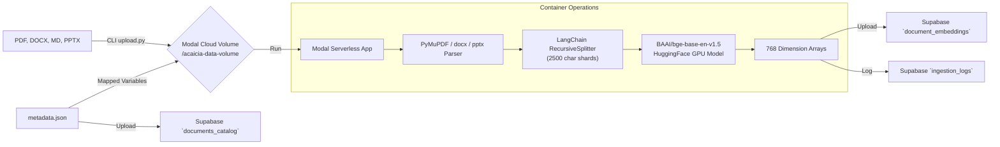

# GPU Data Ingestion Pipeline

[← Back to README](../README.md)

To keep embedding costs practically zero and process massive libraries exceptionally quickly, the ingestion framework (`ingestion/`) operates directly on **Modal Volumes and T4/A10G Cloud GPUs**.

## Pipeline Architecture

## How It Works

1. **Local Upload (`upload.py`)**: 
   The administrator puts `*.pdf`, `*.md`, `*.docx`, and `*.pptx` files into the `ingestion/data/` folder, alongside a `metadata.json` if custom metadata is required. Running `upload.py` synchronizes this folder seamlessly with a stateful Modal Cloud Volume (`acaicia-data-volume`).
2. **Serverless Invocation (`app.py`)**:
   Once files are pushed to the Cloud Volume, `upload.py` triggers the `process_documents` function running on a `T4` GPU in the cloud.
3. **Chunking**:
   The `LangChain` `RecursiveCharacterTextSplitter` chunks the text into shards of 2,500 characters with an overlap of 250 characters.
4. **Vector Embedding**:
   The worker harnesses `sentence-transformers` (`BAAI/bge-base-en-v1.5`) mapped directly to VRAM to swiftly transform the text shards into 768-D vectors.
5. **Database Syncing & Logging**:
   The vectors, their texts, and their metadata are inserted into `document_embeddings` and `documents_catalog` in Supabase. Successful and failed state records are kept natively via `/data/ingestion_state.json` inside the cloud volume, meaning interrupted jobs resume perfectly!
