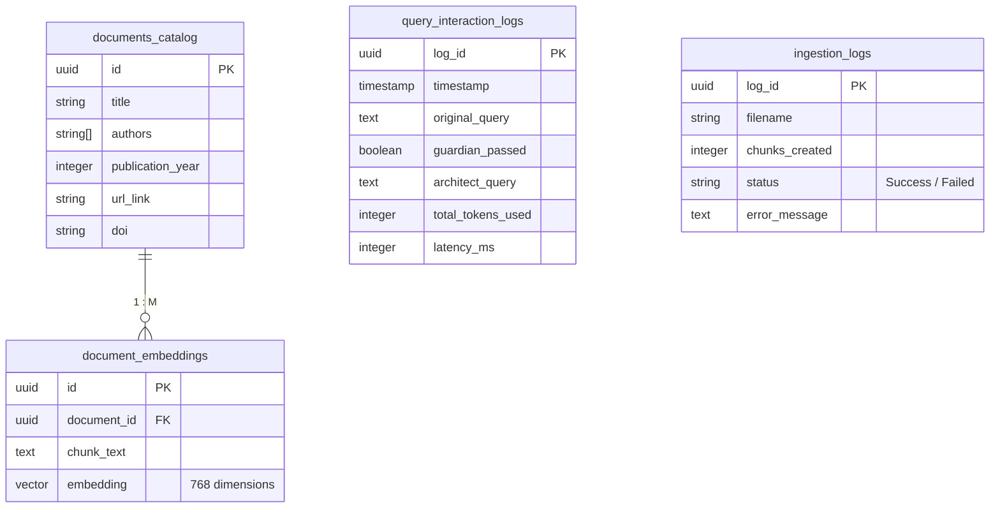

# Database Architecture

[← Back to README](../README.md)

acAIcia is backed by Supabase (PostgreSQL). It leverages the `pgvector` extension to merge structured relational data tightly with unstructured multi-dimensional floating-point arrays (Embeddings). 

The schema is defined in `database/schema.sql`.

## Schema Definition



## Key Capabilities

1. **`pgvector` indexing**: 
   The embeddings table defines `embedding vector(768)` and uses an **HNSW** (Hierarchical Navigable Small World) index:
   ```sql
   create index on document_embeddings using hnsw (embedding vector_cosine_ops);
   ```
   This ensures hyper-fast cosine similarity lookups over thousands of vectors.

2. **RPC Matching (`match_documents`)**: 
   Vector similarity operations are pushed down into the database via a raw SQL function. The function takes the user's `query_embedding`, a `match_threshold`, and a `match_count`, running a direct mathematical sorting (`<=>`) operator natively on Postgres, returning the combined relational `title`/`authors` data and the chunk text in a single REST payload.

3. **Analytics**:
   The isolated `query_interaction_logs` and `ingestion_logs` tables provide a highly secure sandbox for BI visualization natively via the Supabase dashboard without polluting the actual embeddings schema.
