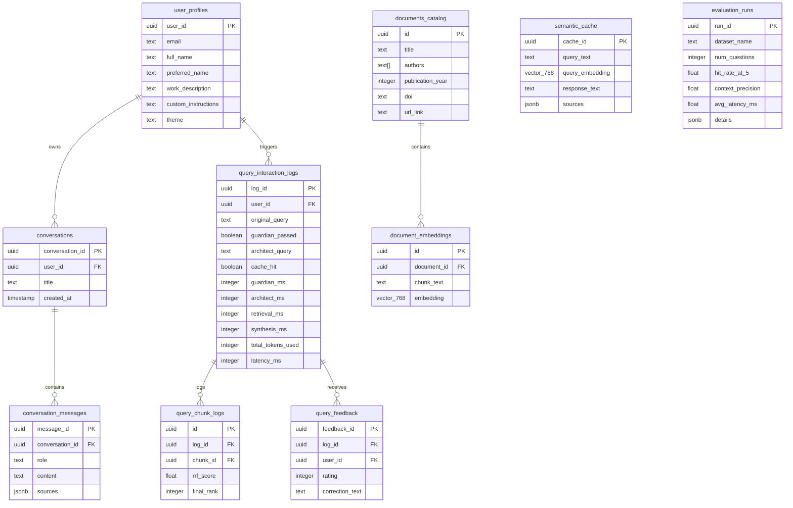

# Database Schema (Supabase Postgres)

[← Back to README](../README.md)

acAIcia utilizes **Supabase** (Postgres 15+) with the `pgvector` extension enabled for storing document catalogs, 768-dimensional vector embeddings (`BAAI/bge-base-en-v1.5`), user profiles, in-chat feedback, semantic cache, and granular telemetry.

## Entity Relationship Diagram

```mermaid
erDiagram
    user_profiles ||--o{ conversations : owns
    conversations ||--o{ conversation_messages : contains
    documents_catalog ||--o{ document_embeddings : contains
    query_interaction_logs ||--o{ query_chunk_logs : logs
    query_interaction_logs ||--o{ query_feedback : receives
    user_profiles ||--o{ query_interaction_logs : triggers
    
    user_profiles {
        uuid user_id PK
        text email
        text full_name
        text preferred_name
        text work_description
        text custom_instructions
        text theme
    }
    
    conversations {
        uuid conversation_id PK
        uuid user_id FK
        text title
        timestamp created_at
    }

    conversation_messages {
        uuid message_id PK
        uuid conversation_id FK
        text role
        text content
        jsonb sources
    }

    documents_catalog {
        uuid id PK
        text title
        text[] authors
        integer publication_year
        text doi
        text url_link
    }

    document_embeddings {
        uuid id PK
        uuid document_id FK
        text chunk_text
        vector_768 embedding
    }

    query_interaction_logs {
        uuid log_id PK
        uuid user_id FK
        text original_query
        boolean guardian_passed
        text architect_query
        boolean cache_hit
        integer guardian_ms
        integer architect_ms
        integer retrieval_ms
        integer synthesis_ms
        integer total_tokens_used
        integer latency_ms
    }

    query_chunk_logs {
        uuid id PK
        uuid log_id FK
        uuid chunk_id FK
        float rrf_score
        integer final_rank
    }

    query_feedback {
        uuid feedback_id PK
        uuid log_id FK
        uuid user_id FK
        integer rating
        text correction_text
    }

    semantic_cache {
        uuid cache_id PK
        text query_text
        vector_768 query_embedding
        text response_text
        jsonb sources
    }

    evaluation_runs {
        uuid run_id PK
        text dataset_name
        integer num_questions
        float hit_rate_at_5
        float context_precision
        float avg_latency_ms
        jsonb details
    }
```

---

## Stored Functions (RPC)

### 1. `match_documents_hybrid` (Reciprocal Rank Fusion)
Combines dense vector similarity (`<=> query_embedding`) with PostgreSQL full-text search (`to_tsvector` / `websearch_to_tsquery`) using Reciprocal Rank Fusion:
$$\text{RRF Score} = \frac{1}{k + r_{\text{vector}}} + \frac{1}{k + r_{\text{text}}}$$
This function ensures exact matches on DOIs, species names, dates, and geographic locations are ranked highest.

### 2. `match_semantic_cache`
Queries `semantic_cache` using HNSW cosine distance (`1 - (query_embedding <=> cache_embedding)`). If similarity >= 0.95, returns stored answer and citations instantly.

---

## Database Migrations
All new tables, indices, and stored functions are defined in [database/migrations/001_add_auth_and_telemetry.sql](../database/migrations/001_add_auth_and_telemetry.sql). Execute this SQL file in your Supabase SQL Editor to initialize or upgrade your database schema.
