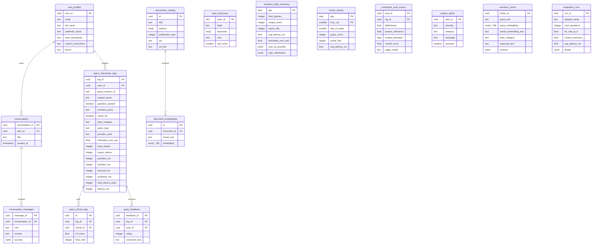

# Database Schema (Supabase Postgres)

[← Back to README](../README.md)

acAIcia utilizes **Supabase** (Postgres 15+) with the `pgvector` extension enabled for storing document catalogs, 768-dimensional vector embeddings (`BAAI/bge-base-en-v1.5`), user profiles, in-chat feedback, semantic cache, and granular telemetry.

## Entity Relationship Diagram

```mermaid
erDiagram
    user_profiles ||--o{ conversations : owns
    conversations ||--o{ conversation_messages : contains
    documents_catalog ||--o{ document_embeddings : contains
    query_interaction_logs ||--o{ query_chunk_logs : logs
    query_interaction_logs ||--o{ query_feedback : receives
    user_profiles ||--o{ query_interaction_logs : triggers
    
    user_profiles {
        uuid user_id PK
        text email
        text full_name
        text preferred_name
        text work_description
        text custom_instructions
        text theme
    }
    
    conversations {
        uuid conversation_id PK
        uuid user_id FK
        text title
        timestamp created_at
    }

    conversation_messages {
        uuid message_id PK
        uuid conversation_id FK
        text role
        text content
        jsonb sources
    }

    documents_catalog {
        uuid id PK
        text title
        text[] authors
        integer publication_year
        text doi
        text url_link
    }

    document_embeddings {
        uuid id PK
        uuid document_id FK
        text chunk_text
        vector_768 embedding
    }

    query_interaction_logs {
        uuid log_id PK
        uuid user_id FK
        text guest_session_id
        text original_query
        boolean guardian_passed
        text architect_query
        boolean cache_hit
        text topic_category
        text query_type
        text provider_used
        float estimated_cost_usd
        integer input_tokens
        integer output_tokens
        integer guardian_ms
        integer architect_ms
        integer retrieval_ms
        integer synthesis_ms
        integer total_tokens_used
        integer latency_ms
    }

    topic_taxonomy {
        text topic_id PK
        text label
        text[] keywords
        text icon
        smallint sort_order
    }

    analytics_daily_summary {
        date day PK
        integer total_queries
        integer unique_users
        integer cache_hits
        float avg_latency_ms
        float estimated_cost_usd
        jsonb cost_by_provider
        jsonb topic_distribution
    }

    hourly_activity {
        date day PK
        smallint hour_utc PK
        smallint day_of_week
        integer query_count
        integer cache_hits
        float avg_latency_ms
    }

    production_eval_scores {
        uuid eval_id PK
        uuid log_id FK
        float faithfulness
        float answer_relevance
        float context_precision
        float overall_score
        text judge_model
    }

    system_alerts {
        uuid alert_id PK
        text severity
        text category
        text message
        boolean resolved
    }

    query_chunk_logs {
        uuid id PK
        uuid log_id FK
        uuid chunk_id FK
        float rrf_score
        integer final_rank
    }

    query_feedback {
        uuid feedback_id PK
        uuid log_id FK
        uuid user_id FK
        integer rating
        text correction_text
    }

    semantic_cache {
        uuid cache_id PK
        text query_text
        vector_768 query_embedding
        text stored_embedding_text
        text topic_category
        text response_text
        jsonb sources
    }

    evaluation_runs {
        uuid run_id PK
        text dataset_name
        integer num_questions
        float hit_rate_at_5
        float context_precision
        float avg_latency_ms
        jsonb details
    }
```

---

## Stored Functions (RPC) & Views

### 1. `match_documents_hybrid` (Reciprocal Rank Fusion)
Combines dense vector similarity (`<=> query_embedding`) with PostgreSQL full-text search (`to_tsvector` / `websearch_to_tsquery`) using Reciprocal Rank Fusion:
$$\text{RRF Score} = \frac{1}{k + r_{\text{vector}}} + \frac{1}{k + r_{\text{text}}}$$
This function ensures exact matches on DOIs, species names, dates, and geographic locations are ranked highest.

### 2. `match_semantic_cache` (Python Cosine Similarity + Topic Guard)
Evaluates `semantic_cache` using raw user query vector cosine similarity ($\ge 0.98$) and domain `topic_category` scoping. If similarity $\ge 0.98$ within the same research topic, returns stored answer and citations in <50ms.

### 3. `get_analytics_timeseries` (Parametric Daily Time-Series)
Aggregates query volume, cache hits, latencies, tokens, and estimated USD costs filtered by start date, end date, topic, provider, and query type.

### 4. `get_user_cost_breakdown` (Per-User Cost Breakdown)
Aggregates queries, cache hits, token usage, estimated costs, satisfaction ratings, and dominant topic per user (registered user or anonymous guest session).

### 5. `get_hourly_heatmap` (7×24 Time-of-Day Activity)
Calculates query volume, cache hits, and latencies grouped by hour of day (0-23) and day of week (0=Sunday..6=Saturday).

### 6. `popular_documents` (View)
Ranks documents catalog entries by total retrieval count in `query_chunk_logs` and average RRF score.

---

## Database Migrations
Run SQL migrations in order in your Supabase SQL Editor:
- [001_add_auth_and_telemetry.sql](../database_schema.sql) — User profiles, conversation history, telemetry, RRF retrieval.
- [002_fix_semantic_cache.sql](../database/migrations/002_fix_semantic_cache.sql) — Add comma-separated embedding text representation.
- [003_advanced_analytics.sql](../database/migrations/003_advanced_analytics.sql) — Analytics schema, topic taxonomy, cost tracking, RAGAS scores, alerts, and views.
- [004_fix_semantic_cache_topic_guard.sql](../database/migrations/004_fix_semantic_cache_topic_guard.sql) — Add domain topic category isolation to semantic cache, set similarity threshold to 0.98, and align raw query vector storage.
- [005_evaluation_system.sql](../database/migrations/005_evaluation_system.sql) — Evaluation infrastructure: per-question details, run configuration metadata, canary tracking, and score-trend views.
- [006_fix_hybrid_retrieval_perf.sql](../database/migrations/006_fix_hybrid_retrieval_perf.sql) — HNSW vector + GIN full-text indexes on `document_embeddings`; fixes `match_documents_hybrid` statement-timeout failures.
- [007_db_security_perf_hardening.sql](../database/migrations/007_db_security_perf_hardening.sql) — Invoker-safe `popular_documents` view, pinned function `search_path`, FK covering indexes, duplicate-index cleanup.
- [008_lock_down_public_rls.sql](../database/migrations/008_lock_down_public_rls.sql) — Enable RLS (deny-by-default, no policies) on the four core tables. See [ADR 0010](adrs/0010-database-security-posture-rls-deny-by-default.md).

### Security posture
All `public` tables run with **RLS enabled and no policies**: the `anon`/`authenticated`
roles have no access, while the backend's `service_role` key bypasses RLS. The
frontend never connects to Supabase directly. Any new table must enable RLS.

