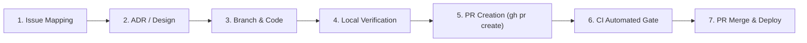

# SOP 001: Branching, Pull Request & Deployment Governance

- **Effective Date**: 2026-09-29
- **Status**: ACTIVE & MANDATORY
- **Applies to**: All Engineers, AI Coding Agents, CI/CD Workflows, and Maintainers

---

## 1. Purpose & Scope

The acAIcia research assistant serves scientific and forestry researchers at Landscape Alliance (CIFOR-ICRAF). Downtime, retrieval quality regressions, or unverified database schema mutations directly jeopardize active research workloads.

This Standard Operating Procedure (SOP) defines the mandatory lifecycle for all code changes, database migrations, and deployments. **Direct pushes to protected branches (`main`, `staging`) are strictly prohibited.** All changes must arrive via reviewed, CI-tested Pull Requests.

---

## 2. Branch Architecture & Protection Policies

| Branch | Environment | Protection Rules | Allowed Ingestion |
| :--- | :--- | :--- | :--- |
| **`main`** | **Production** (`acaicia.org`, `acaicia-backend-production`) | Protected by `.github/workflows/main-guard.yml`. Direct pushes will fail CI. | Merged Pull Requests from `staging` (or critical hotfix PRs). |
| **`staging`** | **Staging / Pre-production** | Integration testing branch. Protected against uncoordinated direct pushes. | Merged Pull Requests from feature/fix branches. |
| **`feat/*`**, **`fix/*`**, **`docs/*`**, **`chore/*`** | **Ephemeral Working Branches** | Unprotected. Created locally, pushed to GitHub remote for PR generation. | Direct commits by author. |

---

## 3. Strict Operating Lifecycle

Every code or configuration update MUST follow this 7-step sequence:



### Step 1: Issue Association
- Every code change must trace to a tracked GitHub Issue (`gh issue list` or `BACKLOG.md`).
- Name feature branches predictably:
  - Feature: `feat/<issue-id>-<brief-description>` (e.g., `feat/1-sse-streaming`)
  - Bugfix / Hotfix: `fix/<issue-id>-<brief-description>` (e.g., `fix/14-admin-csv-401`)
  - Documentation: `docs/<brief-description>` (e.g., `docs/branch-governance-sop`)

### Step 2: Architecture Decision Record (ADR)
- Any modification touching:
  - Database schema, RPC functions, or pgvector indexes (e.g., ADR 0010, 0012, 0015)
  - Multi-replica state storage or caching (e.g., ADR 0011)
  - LLM providers, routing, or gateways (e.g., ADR 0014)
  - Search/retrieval models or rerankers (e.g., ADR 0013)
  **MUST** have an accepted or proposed ADR in `docs/adrs/` before or alongside the PR.

### Step 3: Branching & Local Development
- Always create a dedicated branch off the latest clean `main` or `staging`:
  ```bash
  git checkout main
  git pull origin main
  git checkout -b feat/<issue-id>-<description>
  ```
- Always use the dedicated virtualenv for Python (`.venv/bin/python`, `.venv/bin/pytest`).
- Frontend commands must be run within `frontend/` (`npm run build`).

### Step 4: Rigorous Local Pre-Flight Verification
Before pushing to remote:
1. **Backend Tests**: Run full suite:
   ```bash
   .venv/bin/pytest tests/
   ```
   *Requirement*: 100% passing tests (zero failures, zero regressions).
2. **Frontend Typecheck & Build**:
   ```bash
   cd frontend && npm run build
   ```
   *Requirement*: 0 TypeScript errors.
3. **Database Security Check**: If SQL was modified, ensure every table has `ALTER TABLE ... ENABLE ROW LEVEL SECURITY;` and functions have explicit security postures (`SECURITY INVOKER` or `SECURITY DEFINER` per ADR 0010).

### Step 5: Push Branch & Open Pull Request
- Push the branch to GitHub:
  ```bash
  git push -u origin feat/<issue-id>-<description>
  ```
- Open a Pull Request targeting `staging` (or `main` if promoting staging):
  ```bash
  gh pr create --title "feat(#ID): Brief Summary" --body "Closes #ID. Details..." --base staging
  ```

### Step 6: Automated CI Gates & Verification
- CI workflows automatically trigger on PR:
  - `pr.yml`: Python test suite + Vite production build typecheck.
  - `eval-gate.yml`: RAG retrieval regression checks.
  - `main-guard.yml`: Enforces that changes entering `main` originated from an associated PR.
- Wait for all checks to report green:
  ```bash
  gh pr checks
  ```

### Step 7: PR Merge & Promotion
- Once all checks pass and changes are approved, merge via GitHub CLI or UI:
  ```bash
  gh pr merge --squash --delete-branch
  ```
- To promote `staging` to `main`:
  ```bash
  gh pr create --title "chore: Promote staging to main" --base main --head staging
  gh pr merge --merge
  ```

---

## 4. Anti-Patterns & Prohibited Actions (Zero Tolerance)

| Prohibited Action | Risk / Consequence | Required Alternative |
| :--- | :--- | :--- |
| **Direct push to `main` (`git push origin main`)** | Violates `main-guard.yml`, triggers CI alert, risks deploying untested changes to production. | **Always** open a PR and merge via `gh pr merge`. |
| **Direct push to `staging` (`git push origin staging`)** | Bypasses PR review and CI pre-merge checks. | Create a feature branch and target `staging` via PR. |
| **Force pushing to protected branches (`git push -f`)** | Destroys commit history and breaks team synchronization. | Force-pushing is strictly disabled on `main` and `staging`. |
| **Skipping local tests before pushing** | Fails remote CI and burns GitHub Actions minutes. | Always run `.venv/bin/pytest tests/` and `npm run build` locally. |
| **Direct SQL mutations in Supabase without migration file** | Schema drift between repo and production DB. | Commit migration script to `database/migrations/NNN_*.sql` and record in ADR. |
| **Disabling or weakening existing tests** | Masked regressions in retrieval accuracy or safety. | Fix the root cause or update the test only with documented rationale. |

---

## 5. Deployment Verification Checklist

After a PR is merged and deployment initiates:
1. **Check Railway Deployment Status**:
   ```bash
   railway deployment list --service "acAIcia Backend"
   ```
2. **Probe Health & Settings Endpoint**:
   ```bash
   curl -fsS https://acaicia-backend-production.up.railway.app/settings
   ```
3. **Execute Live Smoke Test**:
   - Verify `/query/stream` returns valid SSE events (`stage`, `token`, `done`, `telemetry`).
   - Verify `/query` creates job entries in Supabase `query_jobs`.
   - Verify `https://acaicia.org` loads with 0 console errors.
